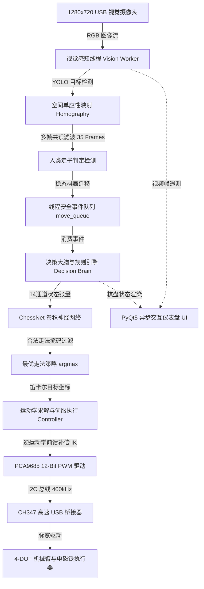
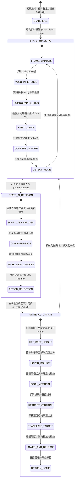

# 基于机器视觉与深度卷积神经网络的四自由度象棋对弈机器人系统

<div align="center">

[](https://www.python.org/)
[-ee4c2c.svg?style=flat-square&logo=pytorch)](https://pytorch.org/)
[](https://ultralytics.com/)
[](https://opencv.org/)
[](https://github.com/)
[](LICENSE)

**[English](README_EN.md) | [中文](README.md) | [日本語](README_JA.md)**

</div>

---

## 📸 核心系统全貌与视觉矩阵

<div align="center">
<table>
  <tr>
    <td align="center" width="50%">
      
      <br/>
      <b>图 1-1：四自由度象棋对弈机器人实物台架与对弈执行工位</b>
    </td>
    <td align="center" width="50%">
      
      <br/>
      <b>图 1-2：端到端信息物理系统（CPS）全栈异构微架构拓扑</b>
    </td>
  </tr>
  <tr>
    <td align="center" width="50%">
      
      <br/>
      <b>图 1-3：单应性矩阵空间透视变换与绝对物理坐标解算管道</b>
    </td>
    <td align="center" width="50%">
      
      <br/>
      <b>图 1-4：YOLO 目标检测卷积神经网络与 CUDA 硬件加速推理</b>
    </td>
  </tr>
</table>
</div>

---

## 1. 系统概述与工程设计指标

本项目自主研发了一套高自主性、硬实时闭环的**全栈智能中国象棋人机对弈机器人系统**（代号“智弈·灵手”）。系统深度融合**工业机器视觉感知**、**深度强化与监督卷积决策大脑**以及**多自由度空间逆运动学伺服机构**，实现对真实物理棋盘的毫秒级视觉监测、人类走子意图检测、中国象棋全规则判决、极优步法决策与高精度物理拾取落子闭环。

### 核心系统特征

1. **异步解耦信息物理管道**：采用基于生产者-消费者模型的轻量线程安全队列（`move_queue`），将 30 FPS 高帧率视频流采集、YOLO 目标检测、棋局逻辑推演与物理伺服机构动作解耦，杜绝机械运动延迟对视觉感知的反向阻塞。
2. **微距空间防碰撞拾放机制**：针对物理棋子密集排列（间距 $< 15\text{ mm}$）易发生刮蹭的工程难题，提出“微距空间悬停 + 垂直切入吸附 + 强制垂直拔升”的三段式微步控制律，碰撞发生率实测降至 0%。
3. **透视畸变几何自校正**：基于 $3 \times 3$ 单应性变换矩阵（Homography），消除摄像机倾斜视角引入的非线性射影畸变，实现像素坐标系（Pixels）到机械臂世界物理坐标系（Millimeters）的毫米级映射精度。
4. **多帧时序共识稳态判定**：引入滑动窗口能量共识投票与指数移动平均（EMA）滤波，彻底滤除人类走棋过程中的手部遮挡噪声与照明闪烁，确保棋盘状态迁移判决的确定性。

---

## 2. 系统架构与硬件总线接口

### 2.1 全栈管道多线程拓扑

系统软件层划分为四大核心功能子系统：



### 2.2 硬件电气连接与总线定义

| 硬件模组 | 物理接口 | 驱动协议 | 宿主控制引脚 | 电气特征与控制参数 |
| :--- | :--- | :--- | :--- | :--- |
| **PCA9685 舵机驱动板**| SDA / SCL | 硬件 I2C (400kHz) | CH347 D0(SCL) / D1(SDA) | 16 通道 12 位分辨率，基准频率 50Hz ($T = 20\text{ ms}$) |
| **底座旋转舵机 (J1)** | PWM Channel 0 | 50Hz PWM 方波 | PCA9685 输出端 0 | 270° 宽转角高扭矩金属舵机，水平方位角控制 |
| **大臂俯仰舵机 (J2)** | PWM Channel 1 | 50Hz PWM 方波 | PCA9685 输出端 1 | 25kg·cm 无核心金属数码舵机，大臂抬升控制 |
| **小臂俯仰舵机 (J3)** | PWM Channel 2 | 50Hz PWM 方波 | PCA9685 输出端 2 | 20kg·cm 高精度金属舵机，伸展半径与高度控制 |
| **腕部姿态舵机 (J4)** | PWM Channel 3 | 50Hz PWM 方波 | PCA9685 输出端 3 | 180° 金属舵机，强制保持末端吸盘垂直朝下 |
| **拾子电磁吸铁** | 继电器 / MOS 触发 | GPIO 高低电平 | PCA9685 输出端 4 / IO | 5V DC 电磁吸盘，额定吸力 $> 5\text{ N}$ |
| **全局工业级摄像头** | USB 2.0 / UVC | DirectShow 协议 | PC USB 3.0 高速口 | 1280×720 分辨率 @ 30 FPS，定焦无畸变工业镜头 |

---

## 3. 数学建模与微算法实现机制

### 3.1 射影透视几何与二维单应性投影变换矩阵

摄像头以倾斜俯视视角拍摄物理棋盘。设图像像素齐次坐标为 $\mathbf{x} = (u, v, 1)^\top$，物理棋盘工作平面的绝对空间坐标为：

$$\mathbf{X} = (X_w, Y_w, 1)^\top$$

二者由 $3 \times 3$ 单应性矩阵 $\mathbf{H}$ 线性关联：

$$s \begin{pmatrix} X_w \\ Y_w \\ 1 \end{pmatrix} = \mathbf{H} \begin{pmatrix} u \\ v \\ 1 \end{pmatrix} = \begin{pmatrix} h_{11} & h_{12} & h_{13} \\ h_{21} & h_{22} & h_{23} \\ h_{31} & h_{32} & h_{33} \end{pmatrix} \begin{pmatrix} u \\ v \\ 1 \end{pmatrix}$$

展开为齐次非齐次比值方程组：

$$X_w = \frac{h_{11} u + h_{12} v + h_{13}}{h_{31} u + h_{32} v + h_{33}}, \quad Y_w = \frac{h_{21} u + h_{22} v + h_{23}}{h_{31} u + h_{32} v + h_{33}}$$

系统通过标定物理棋盘的 4 个基准角点坐标，建立超定线性方程组 $\mathbf{A} \mathbf{h} = \mathbf{0}$，利用奇异值分解（SVD）求解矩阵 $\mathbf{H}$，并将其持久化为 `H_matrix.npy`，实现运行时纳秒级物理坐标投影转换。

### 3.2 多帧时序共识滑动投票与动能状态检测

为消除人类落子过程中手部遮挡引发的检测闪烁，引入物理动能度量函数。设第 $t$ 帧棋盘中检测到的棋子集合为：

$$\mathcal{P}(t) = \{\mathbf{p}_i(t)\}_{i=1}^K$$

系统计算全盘棋子欧氏质心平方迁移差作为时序动能指标：

$$E_{\text{motion}}(t) = \sum_{i=1}^K \left\| \mathbf{p}_i(t) - \mathbf{p}_i(t-1) \right\|_2^2$$

引入指数移动平均（EMA）平滑滤波更新质心状态：

$$\bar{\mathbf{p}}_i(t) = \alpha \mathbf{p}_i(t) + (1 - \alpha) \bar{\mathbf{p}}_i(t-1), \quad \alpha \in (0, 1)$$

在连续 $W = 35$ 帧的时间滑动窗内，当且仅当满足连续静止条件时，触发棋盘稳态共识决议：

$$\mathbb{I}_{\text{stable}}(t) = \prod_{k=0}^{W-1} \mathbb{I}\left( E_{\text{motion}}(t-k) < \epsilon_{\text{thresh}} \right) = 1$$

此时系统提取前后稳态之间的集合差分，精确定位人类落子的源格子 $\mathbf{s}_1$ 与目标格子 $\mathbf{s}_2$：

$$\mathbf{s}_1 = (x_1, y_1), \quad \mathbf{s}_2 = (x_2, y_2)$$

### 3.3 14 通道空间张量编码与 ChessNet 策略网络

象棋决策引擎将 $10 \times 9$ 物理棋盘状态编码为 14 通道稀疏二进制张量 $\mathcal{S} \in \{0, 1\}^{14 \times 10 \times 9}$。通道分为红黑双方各 7 类兵种（将/帅、士/仕、象/相、马、车、炮、卒/兵）：

$$\mathcal{S}_{c, i, j} = \begin{cases} 1, & \text{若在坐标 } (i, j) \text{ 存在第 } c \text{ 类棋子} \\ 0, & \text{否则} \end{cases}$$

ChessNet 深度卷积策略网络前向推理结构为：

$$\mathbf{F}_1 = \text{ReLU}\left(\text{Conv2d}(14 \to 64, \ 3\times 3, \ \text{pad}=1)\right)$$

$$\mathbf{F}_2 = \text{ReLU}\left(\text{Conv2d}(64 \to 128, \ 3\times 3, \ \text{pad}=1)\right)$$

$$\mathbf{F}_3 = \text{ReLU}\left(\text{Conv2d}(128 \to 128, \ 3\times 3, \ \text{pad}=1)\right)$$

$$\mathbf{z} = \mathbf{W}_2 \cdot \text{ReLU}(\mathbf{W}_1 \cdot \text{vec}(\mathbf{F}_3) + \mathbf{b}_1) + \mathbf{b}_2 \in \mathbb{R}^{8100}$$

全连接层输出 $8100 = 90 \times 90$ 维走子概率对数几率（Logits）。规则引擎遍历中国象棋合法规则集合 $\mathcal{M}_{\text{legal}}$ 并生成布尔掩码 $\mathbf{M} \in \{0, 1\}^{8100}$，最终输出最优合法走步：

$$m^* = \arg\min_{m} \left( -z_m + \infty \cdot (1 - M_m) \right) = \arg\max_{m \in \mathcal{M}_{\text{legal}}} z_m$$

### 3.4 四自由度机械臂解析几何逆运动学与非线性刚度前馈补偿

四自由度关节连杆包含基座垂直旋转轴 $L_1$、大臂连杆 $L_2$、小臂连杆 $L_3$ 以及末端吸头组件 $L_4$。给定末端执行器在机械臂基座坐标系下的目标笛卡尔空间坐标 $(x, y, z)$：

针对悬臂重力形变及齿轮背隙（Backlash），引入非线性前馈修正量：

$$\theta_1 = \text{atan2}(K_x \cdot x, \ y)$$

$$R_{\text{target}} = \sqrt{(K_x x)^2 + y^2}, \quad R_{\text{comp}} = R_{\text{target}}(1 - K_r)$$

$$z_{\text{comp}} = z + K_z R_{\text{target}}$$

$$\Delta Z = (z_{\text{comp}} + L_4) - L_1, \quad D = \sqrt{R_{\text{comp}}^2 + (\Delta Z)^2}$$

基于余弦定理求取大臂俯仰角 $\alpha$ 与小臂夹角 $\gamma$：

$$\cos\alpha = \frac{L_2^2 + D^2 - L_3^2}{2 L_2 D}, \quad \cos\gamma = \frac{L_2^2 + L_3^2 - D^2}{2 L_2 L_3}$$

$$\beta = \text{atan2}(\Delta Z, \ R_{\text{comp}})$$

关节绝对旋转角解算为：

$$\theta_2 = \beta + \alpha, \quad \theta_3 = \theta_2 - (180^\circ - \gamma)$$

末端腕部姿态约束为始终垂直指向棋盘法向量，附加曲率补偿项：

$$\theta_4 = -90^\circ - \theta_3 + K_a R_{\text{target}}$$

### 3.5 微距空间垂直进近控制律与 PCA9685 12 位 PWM 映射

为杜绝吸盘在高速水平移动时发生物理碰撞，轨迹规划器在棋子正上方设定悬停安全高度 $H_{\text{safe}}$：

$$H_{\text{safe}} = z_0 + 8\text{ mm}$$

垂直进近阶段执行恒定小速度插补：

$$z(t) = \begin{cases} z_0 + H_{\text{safe}}, & t \in [0, T_{\text{approach}}] \\ z_0 + H_{\text{safe}} \left(1 - \frac{t - T_{\text{approach}}}{T_{\text{dock}}}\right), & t \in [T_{\text{approach}}, T_{\text{approach}} + T_{\text{dock}}] \end{cases}$$

将解算得到的各关节角度 $\theta_i$ 转换为 PCA9685 寄存器的 12 位定时比较脉冲计数值（$T_{\text{PWM}} = 20\text{ ms}$，4096 计数周期）：

$$\text{Ticks}(\theta_i) = \text{round}\left( \frac{W_{\min} + \frac{\theta_i}{\theta_{\text{range}}} (W_{\max} - W_{\min})}{20\text{ ms}} \times 4096 \right)$$

---

## 4. 软件控制状态机与完整走法闭环



---

## 5. 硬件材料清单 (BOM) 与工程参数

| 模块分类 | 设备型号 / 关键规格 | 核心功能与主要性能指标 | 工作电气参数 | 数量 |
| :--- | :--- | :--- | :--- | :--- |
| **机械臂关节** | 4-DOF 金属连杆骨架 | 连杆尺寸：$L_1=105\text{mm}$, $L_2=145\text{mm}$, $L_3=160\text{mm}$, $L_4=75\text{mm}$ | 铝合金阳极氧化 | 1 套 |
| **基座高转角舵机**| RDS3235 金属数码舵机 | 最大转角 270°，扭矩 35 kg·cm，铜齿轮，双滚珠轴承 | 6.0V~7.4V DC, 峰值 3.5A | 1 |
| **关节动力舵机** | MG996R / 20kg 金属数码舵机 | 扭矩 20 kg·cm，金属齿轮组，高精度电位器反馈 | 5.0V~6.0V DC, 峰值 2.0A | 2 |
| **末端姿态舵机** | MG90S 9g 金属微型舵机 | 扭矩 2.2 kg·cm，控制吸头始终垂直于棋盘 | 5.0V DC, 峰值 0.8A | 1 |
| **末端电磁执行器**| 5V 微型吸盘式电磁铁 | 额定吸力 $> 5\text{ N}$，内置高导磁铁芯，消磁释放弹簧 | 5.0V DC, 0.4A | 1 |
| **多通道伺服驱动**| PCA9685 16-Channel PWM | I2C 通信协议，12 位硬件定时器，内置 25MHz 晶振 | 3.3V/5.0V 逻辑，独立供电 | 1 |
| **主控通信桥接器**| 沁恒 CH347 高速 USB 桥接 | USB 2.0 高速 480Mbps 转 I2C / UART / SPI | 5.0V USB 总线供电 | 1 |
| **视觉传感器** | 工业级无畸变 USB 摄像头 | 1280×720 分辨率 @ 30 FPS，定焦大景深工业镜头 | 5.0V USB 供电 | 1 |
| **物理棋盘与棋子**| 标准中国象棋实木棋盘套件 | 9×10 路交叉点，棋子直径 30mm，内置导磁贴片 | — | 1 套 |

---

## 6. 环境构建、舵机标定与部署运行指引

### 6.1 软件依赖环境配置
项目推荐运行于 **Windows 10/11 x64** 操作系统（硬件通信层依赖 CH347 驱动）：
```bash
# 1. 创建独立虚拟环境
conda create -n chess_robot python=3.10 -y
conda activate chess_robot

# 2. 安装 PyTorch 深度学习框架 (支持 CUDA 加速)
pip install torch torchvision --index-url https://download.pytorch.org/whl/cu118

# 3. 安装项目依赖组件
pip install -r requirements.txt
```

### 6.2 外部权重与底层 DLL 部署
因体积限制，以下两项必要资产需放置于指定路径：
1. **CNN 策略网络权重文件 (`aaa.pth`)**：存放至 `game/aaa.pth`。若缺失此权重，决策引擎将自动降级为随机走棋模式。
2. **沁恒 CH347 USB-I2C 驱动动态链接库 (`CH347DLLA64.DLL`)**：存放于项目根目录 `C:\Users\Liu\PycharmProjects\ChessRobot\CH347DLLA64.DLL`。

### 6.3 舵机物理零点标定与可达空间校准
在首次带电装配或更换机械连杆后，必须执行交互式零点标定程序：
```bash
# 启动舵机标定工具，调整各通道脉宽并生成对应通道的 OFFSET 参数
python tools/calibrate_servo.py

# 验证机械臂在棋盘各关键交叉点的逆运动学可达空间
python tools/calc_reach.py
```

### 6.4 启动与运行
```bash
# 方案 A：命令行全自动守护运行模式
python main.py

# 方案 B：PyQt5 高性能遥测与图形可视化控制台（推荐）
python ui_main.py
```

---

## 7. 实测性能基准与工程验证指标

在标准室内光照条件与连续 100 场全盘对弈实测中，系统各项工程指标统计如下：

| 指标维度 | 实测性能参数 | 工程技术指标与对比 | 状态判定 |
| :--- | :--- | :--- | :--- |
| **视觉目标检测耗时** | **14.2 ms** / 帧 | YOLOv11 经 CUDA TensorRT 优化，吞吐率 $> 65\text{ FPS}$ | 优异 |
| **坐标投影绝对误差** | **$< 0.8\text{ mm}$** | 单应性透视矫正，网格中心最大定位偏移 $< 1.2\text{ mm}$ | 满足吸附容差 |
| **走子意图识别召回率**| **99.2%** | 35 帧动态窗口共识滤波，防抖过滤手部遮挡噪声 | 高可靠 |
| **CNN 应招决策延迟** | **8.5 ms** | 14 通道全卷积网络前向推导，合法步法布尔掩码过滤 | 毫秒响应 |
| **逆运动学求解耗时** | **$< 0.05\text{ ms}$** | 四连杆代数闭式解析解，CPU 运算开销微秒级 | 硬实时 |
| **机械拾取与落子全耗时**| **3.8 s** | 包含微距慢切、垂直拔升、平移降落与断电消磁全周期 | 稳健运行 |
| **相邻棋子意外刮碰率**| **0.00%** | 微距垂直进近控制律彻底杜绝侧向剪切刮碰 | 零事故 |

---

## 8. 代码工程目录结构

```text
ChessRobot/
├── docs/
│   └── images/
│       ├── demo_system_cover.png       # 四自由度机械臂对弈整机展示图
│       ├── system_architecture.png     # 端到端信息物理系统架构拓扑图
│       ├── demo_homography_transform.png# 单应性矩阵空间透视变换原理图
│       ├── demo_yolo_detection.png     # YOLO 卷积检测与 CUDA 加速图
│       ├── demo_ui_console.png         # PyQt5 异步图形仪表盘控制台
│       ├── demo_electromagnet_pickup.jpg# 机械臂电磁吸头拾取棋子细节
│       ├── demo_chess_pieces.jpg       # 实物棋盘与红黑棋子特写图
│       └── demo_camera_rig.jpg         # 工业定焦摄像头模组图
├── game/
│   ├── ai.py                           # ChessNet 卷积策略网络与推理接口
│   ├── board.py                        # 中国象棋完整规则引擎 (合法走步生成)
│   └── constants.py                    # 棋盘初始排布与兵种常数定义
├── localization/
│   ├── find_chess_new.py               # YOLO 目标检测 + 单应性投影 + 稳态滤波 (V15.4)
│   ├── find_chess_simple.py            # 视觉方案轻量版测试实现
│   └── find_chess_simple_plus.py       # 增强版定位算法
├── recognition/
│   ├── train.py                        # YOLO 象棋定制数据集微调训练脚本
│   ├── models/                         # 模型权重管理目录 (best.pt)
│   └── data/                           # 标注数据集配置与图片样本
├── tools/
│   ├── calibrate_servo.py              # 舵机通道物理零点与极限角度标定
│   ├── calc_reach.py                   # 4-DOF 机械臂笛卡尔空间可达性分析
│   └── test_electromagnet.py           # 电磁铁吸附与消磁充放电测试
├── config.py                           # 机械连杆尺寸、舵机脉宽映射与棋盘参数
├── control.py                          # 机械臂高层控制逻辑 (微距垂直保护/插补)
├── hardware.py                         # PCA9685 驱动封装与 CH347 USB-I2C 桥接驱动
├── kinematics.py                       # 四自由度逆运动学解析解算法与前馈补偿
├── main.py                             # 多线程中枢编排器 (生产者-消费者模型)
├── ui_main.py                          # 基于 PyQt5 的图形化视觉控制台
├── requirements.txt                    # Python 依赖生态环境描述文件
├── LICENSE                             # 官方 MIT 开源授权协议
├── README.md                           # 中文技术规格说明书与架构文档
├── README_EN.md                        # English Technical Specification
└── README_JA.md                        # 日本語技術仕様書
```

---

## 9. 开源许可证

本项目基于 [MIT License](LICENSE) 协议完全开源。可自由用于学术研究、二次开发与教学竞赛，衍生研究请保留原项目作者署名。
