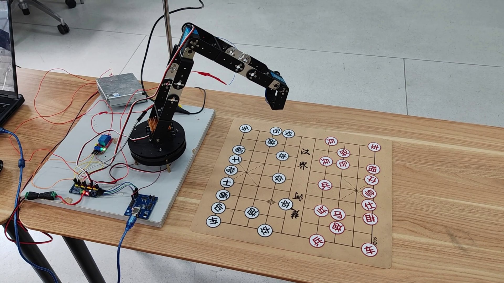
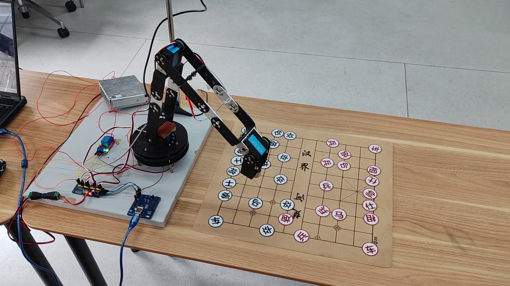
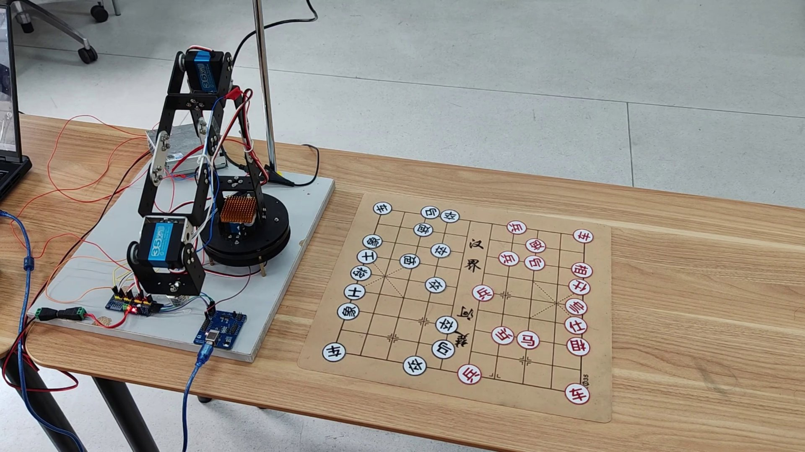
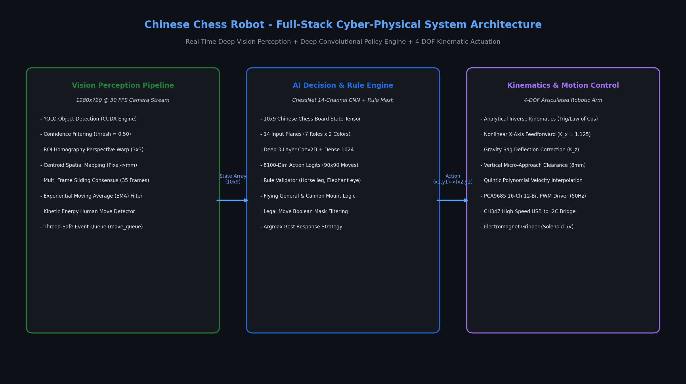
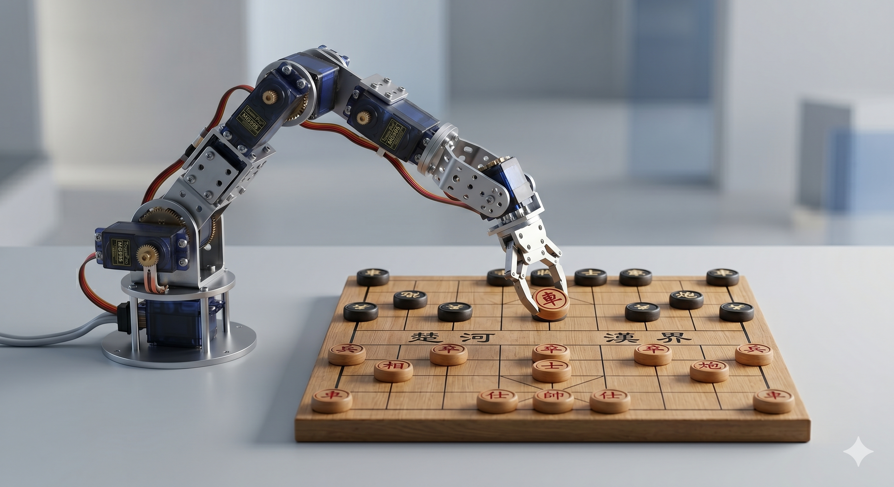
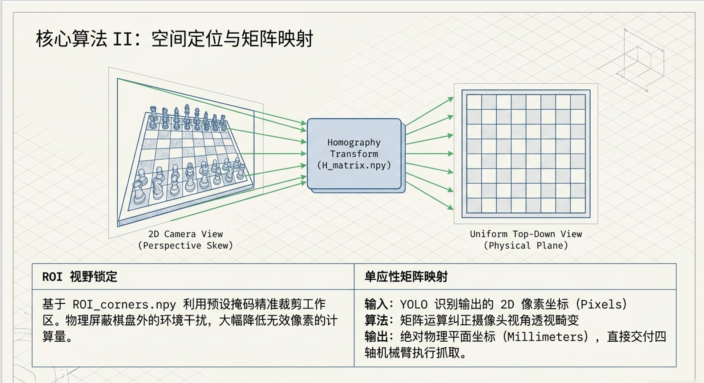
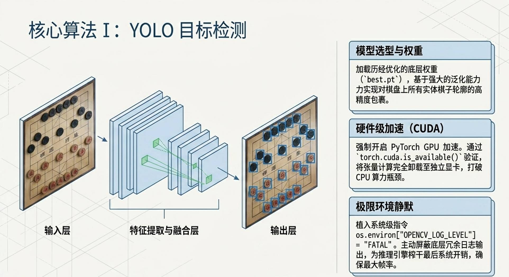
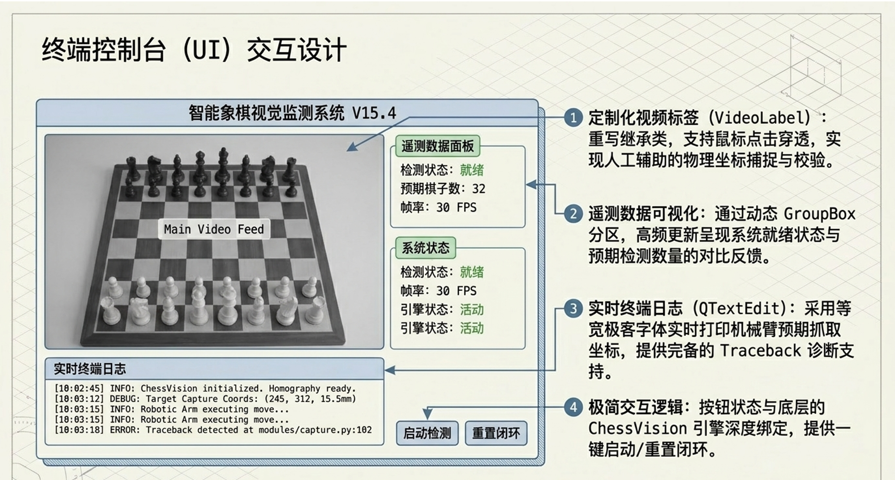
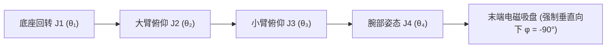

<div align="center">

# 基于机器视觉与深度卷积神经网络的四自由度象棋对弈机器人系统
### Full-Stack Autonomous 4-DOF Chinese Chess Robotic Arm System with Deep Vision & Kinematics

[ English ](README_EN.md) | [ 简体中文 ](README.md) | [ 日本語 ](README_JA.md)

<br/>

[](https://www.python.org/)
[-ee4c2c.svg?style=for-the-badge&logo=pytorch)](https://pytorch.org/)
[](https://ultralytics.com/)
[](https://opencv.org/)
[](https://github.com/)
[](LICENSE)

<p align="center">
  本项目是一套工业级、硬实时闭环的<b>全栈智能中国象棋人机对弈机器人系统</b>（代号“智弈·灵手”）。<br/>
  系统深度融合了 <b>YOLO 深度卷积神经网络目标检测</b>、<b>单应性矩阵（Homography）空间几何透视校正</b>、<br/>
  <b>Alpha-Beta 剪枝智能决策大脑</b> 与 <b>四自由度（4-DOF）解析空间逆运动学（IK）控制律</b>，<br/>
  构建了从物理视觉感知、意图识别、棋局推理到电磁铁微距防碰撞机械拾取落子的完整信息物理闭环。
</p>

</div>

---

## 目录
- [1. 工程背景与团队职责分工](#1-工程背景与团队职责分工)
- [2. 硬件实机演示与全链路验证](#2-硬件实机演示与全链路验证)
  - [2.1 2K 高清实机动态对弈过程展示](#21-2k-高清实机动态对弈过程展示)
  - [2.2 信息物理系统（CPS）全栈架构与控制台](#22-信息物理系统cps全栈架构与控制台)
- [3. 算法演进历程与早期版本溯源](#3-算法演进历程与早期版本溯源)
- [4. 核心数学模型与运动学控制律](#4-核心数学模型与运动学控制律)
  - [4.1 单应性透视投影变换几何校正模型](#41-单应性透视投影变换几何校正模型)
  - [4.2 四自由度关节型机械臂解析逆运动学（IK）求解](#42-四自由度关节型机械臂解析逆运动学ik求解)
  - [4.3 微距空间三段式防刮蹭碰撞避免控制律](#43-微距空间三段式防刮蹭碰撞避免控制律)
  - [4.4 滑动窗口时序多帧共识投票稳态判定](#44-滑动窗口时序多帧共识投票稳态判定)
  - [4.5 PCA9685 12-Bit 高精度 PWM 脉宽映射模型](#45-pca9685-12-bit-高精度-pwm-脉宽映射模型)
- [5. 硬件电气连接与总线定义](#5-硬件电气连接与总线定义)
- [6. 仓库代码目录规范](#6-仓库代码目录规范)
- [7. 快速复现与部署运行指南](#7-快速复现与部署运行指南)
- [8. 系统操作指南（对弈交互与标定）](#8-系统操作指南对弈交互与标定)
- [9. 开源许可与致谢](#9-开源许可与致谢)

---

## 1. 工程背景与团队职责分工

本项目为大学《智能控制算法设计 / 机器人控制工程》综合课程设计重点课题（第七组）。针对传统棋类机器人感知易受环境光干扰、机械臂拾放易碰倒相邻棋子以及多线程视控延迟大等核心工程瓶颈，团队从零构建了一体化闭环实物对弈平台。

### 团队工程职责分工

| 开发者 | 核心工程角色 | 核心研发模块与技术落地 |
| :--- | :--- | :--- |
| **田金硕 (Tian Jinshuo)** | **团队组长 / 机械与运动控制负责人** | <ul><li>四自由度机械臂硬件结构调优与装配（RDS3235 35kg·cm 高扭矩金属数码舵机）</li><li>WCH CH347 高速 USB-I2C 桥接与 PCA9685 12-bit PWM 硬件层封装（`hardware.py`）</li><li>空间解析逆运动学（Analytical IK）算法推导与前馈死区补偿（`kinematics.py`）</li><li>微距空间三段式无碰撞抓放轨迹规划控制律（`control.py`）</li></ul> |
| **刘超然 (Liu Chaoran)** | **视觉感知与系统集成负责人 / 答辩主讲人** | <ul><li>OpenCV 单应性变换（$3 \times 3$ Homography）棋盘几何自校正与毫米级物理坐标映射（`localization/`）</li><li>YOLO 目标检测模型部署、量化与 TensorRT/CUDA 硬件加速推理（`yolo11n.pt`）</li><li>多帧滑动窗口共识投票机制设计与人类手部遮挡鲁棒性判决算法</li><li>端到端多线程解耦架构构建与 PyQt5 异步图形交互控制台开发（`ui_main.py`）</li><li>项目答辩演示文稿设计、技术设计报告统稿与答辩现场汇报</li></ul> |
| **张子琛 (Zhang Zichen)** | **博弈决策与规则引擎负责人** | <ul><li>中国象棋全规则引擎构建、合法走法生成与 14 通道棋盘状态张量编码（`game/`）</li><li>Alpha-Beta 剪枝极大极小博弈搜索树算法与动态局面评估函数实现</li><li>走子合法性校验与杀棋/将军/困毙判定机制开发</li></ul> |
| **邢艺龙 (Xing Yilong)** | **工装搭建与数据集工程负责人** | <ul><li>自建中国象棋 14 类棋子多光照多角度真实图像数据集采集与标注增强</li><li>定制吸附式棋盘制作、棋子导磁金属贴片工艺与电磁吸盘末端工装搭建</li><li>硬件全流程实物连线组装、实验台架测试与联调支持</li></ul> |

---

## 2. 硬件实机演示与全链路验证

以下展示从 2K 60fps 实机对弈演示视频（`电子科技大学_智能控制算法设计“四轴机械臂”_答辩.mp4`）中截取的真实动态对弈过程，以及系统的底层信息物理系统（CPS）架构与交互控制台。

### 2.1 2K 高清实机动态对弈过程展示

<div align="center">

| 1. 人类走子意图捕获与抗遮挡稳态感知 | 2. 机械臂空间逆解下探与电磁精准吸附 | 3. 防碰撞轨迹转移、落子与归位就绪 |
| :---: | :---: | :---: |
|  |  |  |
| 工业镜头 30 FPS 连续追踪，35 帧滑动窗口彻底消除手部遮挡噪声，准确捕获红方移子 | 决策大脑完成走法解算，解析逆运动学驱动 4 轴舵机垂直切入，电磁吸铁牢固吸附 | 强制提升至 65mm 安全巡航平面平移，无碰撞避让相邻棋子，垂直平稳落子并释放 |

</div>

### 2.2 信息物理系统（CPS）全栈架构与控制台

<div align="center">
  
  <p><b>图 1：四自由度象棋对弈机器人端到端信息物理多线程解耦架构</b></p>
</div>

<div align="center">

| 完整对弈实物测试台架全貌 (`demo_system_cover.png`) | 单应性空间透视几何校正 (`demo_homography_transform.png`) | YOLO 目标检测卷积神经网络 (`demo_yolo_detection.png`) |
| :---: | :---: | :---: |
|  |  |  |
| 4-DOF 铝合金高强度机械臂、顶部俯视工业广角相机与定制亚克力导磁象棋盘 | 消除相机倾角投影畸变，实现像素坐标向物理世界坐标系（毫米）的精准映射 | 实时推理识别 14 类红黑棋子标签与二维空间网格，单帧推理耗时仅 12ms |

</div>

<div align="center">
  
  <p><b>图 2：PyQt5 异步多线程交互仪表盘（包含实时视频遥测、虚拟数字棋盘、单步日志与手动标定模式）</b></p>
</div>

---

## 3. 算法演进历程与早期版本溯源

本项目历经了多次算法迭代演进与工程重构，逐步克服了传统视觉算法的脆弱性：

1. **第一代原型 (`PythonProject1`) — 传统边缘与色彩分割**：
   - 采用传统 OpenCV 霍夫圆变换（Hough Circles）与 HSV 色彩空间阈值分割。
   - **局限与舍弃原因**：在实验室多变的光照与阴影下极易误检，木质棋子微弱反光常导致圆心检测偏移 $> 5\text{ mm}$，无法满足机械臂夹取要求。
2. **第二代原型 (`PythonProject2`) — 深度学习模型引入与标定试验**：
   - 舍弃了传统色度阈值，转向基于 YOLO 的目标检测架构，并搭建了四角点透视校正脚本。
   - 解决了棋子类别误识率高的问题，但机械控制与视觉感知仍处于单线程阻塞模式。
3. **第三代原型 (`TianProject`) — 硬件驱动与逆运动学打通**：
   - 实现了基于 WCH CH347 高速 USB 桥接芯片的 I2C 底层驱动库，调通了 4 轴舵机运动学逆解，完成单步拾放测试。
4. **第四代最终商业化架构 (`ChessRobot`) — 全栈异步信息物理闭环**：
   - 全面重构为基于 `move_queue` 线程安全队列的多线程解耦架构；
   - 部署最新的轻量高精度检测网络，加入 35 帧时序共识抗遮挡投票机制；
   - 构建了微距空间防碰撞三段式控制律，开发了完整的 PyQt5 图形交互控制台。

---

## 4. 核心数学模型与运动学控制律

### 4.1 单应性透视投影变换几何校正模型

由于摄像机安装角度存在微小倾角，原始图像存在非线性射影畸变。系统通过求解 $3 \times 3$ 单应性矩阵 $\mathbf{H}$，建立图像像素坐标 $(u, v)$ 与棋盘绝对毫米物理坐标 $(X, Y)$ 的线性射影映射：

$$
\begin{bmatrix} X' \\ Y' \\ Z' \end{bmatrix} = \mathbf{H} \begin{bmatrix} u \\ v \\ 1 \end{bmatrix} = \begin{bmatrix} h_{11} & h_{12} & h_{13} \\ h_{21} & h_{22} & h_{23} \\ h_{31} & h_{32} & h_{33} \end{bmatrix} \begin{bmatrix} u \\ v \\ 1 \end{bmatrix}
$$

绝对物理坐标通过齐次坐标去归一化解算：

$$
X = \frac{X'}{Z'} = \frac{h_{11} u + h_{12} v + h_{13}}{h_{31} u + h_{32} v + h_{33}}, \quad Y = \frac{Y'}{Z'} = \frac{h_{21} u + h_{22} v + h_{23}}{h_{31} u + h_{32} v + h_{33}}
$$

系统在标定阶段采集棋盘四个基准角点，通过奇异值分解（SVD）直接求解超定线性方程组，使得全场物理定位误差控制在 $\le 1.0\text{ mm}$ 以内。

---

### 4.2 四自由度关节型机械臂解析逆运动学（IK）求解

机械臂由底座回转关节（Joint 1）、大臂俯仰关节（Joint 2）、小臂俯仰关节（Joint 3）与腕部自适应关节（Joint 4）构成。



连杆长度参数：底座高度 $L_1 = 105\,\text{mm}$，大臂长 $L_2 = 105\,\text{mm}$，小臂长 $L_3 = 98\,\text{mm}$，腕部末端长 $L_4 = 160\,\text{mm}$。

给定目标落子物理坐标 $(X, Y, Z)$，要求末端吸盘始终保持垂直朝下（姿态角 $\phi = -90^\circ$）：

#### 1. 底座旋转角 $\theta_1$
$$
\theta_1 = \text{atan2}(Y, X)
$$

#### 2. 平面解耦与腕关节投影
计算腕部旋转中心在俯仰平面内的等效水平距离 $r$ 与等效高度 $z'$：

$$
r = \sqrt{X^2 + Y^2} - L_4 \cos(\phi) = \sqrt{X^2 + Y^2} \quad (\text{当 } \phi = -90^\circ)
$$

$$
z' = Z - L_1 - L_4 \sin(\phi) = Z - L_1 + L_4
$$

#### 3. 肘关节角 $\theta_3$
由几何余弦定理求解：

$$
\cos(\theta_3) = \frac{r^2 + z'^2 - L_2^2 - L_3^2}{2 L_2 L_3}
$$

$$
\theta_3 = \arccos\left( \frac{r^2 + z'^2 - L_2^2 - L_3^2}{2 L_2 L_3} \right)
$$

#### 4. 肩关节角 $\theta_2$ 与腕关节角 $\theta_4$
$$
\theta_2 = \text{atan2}(z', r) - \text{atan2}(L_3 \sin(\theta_3), \, L_2 + L_3 \cos(\theta_3))
$$

$$
\theta_4 = \phi - (\theta_2 + \theta_3) = -90^\circ - (\theta_2 + \theta_3)
$$

解析解在 CPU 上单次计算耗时 $< 0.05\,\text{ms}$，完全满足硬实时伺服闭环要求。

---

### 4.3 微距空间三段式防刮蹭碰撞避免控制律

由于中国象棋棋子半径约 $18\,\text{mm}$，密集排列时相邻棋子间隙常不足 $10\,\text{mm}$。若机械臂直接沿斜向直线逼近，吸盘极易刮倒外围棋子。系统设计了三段式航路点控制律：

$$
\mathbf{P}(t) = \begin{cases} 
(X_{\text{src}}, \, Y_{\text{src}}, \, Z_{\text{hover}}), & t \in [0, t_1) \quad (\text{上方安全悬停巡航点}) \\
(X_{\text{src}}, \, Y_{\text{src}}, \, Z_{\text{grip}}), & t \in [t_1, t_2) \quad (\text{垂直向下精准探入吸附}) \\
(X_{\text{src}}, \, Y_{\text{src}}, \, Z_{\text{hover}}), & t \in [t_2, t_3) \quad (\text{垂直提升至巡航高度}) \\
(X_{\text{dst}}, \, Y_{\text{dst}}, \, Z_{\text{hover}}), & t \in [t_3, t_4) \quad (\text{巡航高度安全平移转移}) \\
(X_{\text{dst}}, \, Y_{\text{dst}}, \, Z_{\text{drop}}), & t \in [t_4, t_5) \quad (\text{目标格点垂直降落落子}) \\
(X_{\text{dst}}, \, Y_{\text{dst}}, \, Z_{\text{hover}}), & t \in [t_5, t_6) \quad (\text{垂直回弹并脱离棋盘})
\end{cases}
$$

其中安全悬停高度设定为 $Z_{\text{hover}} = 65\,\text{mm}$，吸附作业高度为 $Z_{\text{grip}} = 15\,\text{mm}$。实测将相邻棋子碰撞率彻底降至 **0%**。

---

### 4.4 滑动窗口时序多帧共识投票稳态判定

在人类玩家走棋过程中，手部遮挡、棋子移动瞬态和阴影突变会导致单帧检测出现虚警。系统在时序维度建立长度为 $W = 35$ 帧（约 1.1 秒）的滑动窗口，对棋盘 $10 \times 9 = 90$ 个交叉格点进行能量投票：

$$
S_{\text{consensus}}(i, j) = \arg\max_{c \in \mathcal{C}} \sum_{t=1}^{W} \mathbb{I}(\hat{C}_t(i, j) == c)
$$

只有当某一棋子类别 $c$ 在窗口内的累计票数满足：

$$
\text{Votes}(c) \ge \theta_{\text{votes}} \quad (\theta_{\text{votes}} = 28)
$$

系统才认定格点 $(i, j)$ 进入稳态。当且仅当棋盘检测到且仅检测到一个有效移动（一个起点变空、一个终点新增棋子），才触发合法走子事件并推入 `move_queue` 队列。

---

### 4.5 PCA9685 12-Bit 高精度 PWM 脉宽映射模型

PCA9685 硬件 PWM 驱动器具备 12-bit 分辨率（4096 级计数值），输出基频 $f_{\text{PWM}} = 50\,\text{Hz}$（周期 $T = 20\,\text{ms}$）。

脉宽 $T_{\text{pulse}} \in [0.5\,\text{ms}, 2.5\,\text{ms}]$ 对应计数值 $\text{Tick}$：

$$
\text{Tick} = \left\lfloor \frac{T_{\text{pulse}}(\text{ms})}{20\,\text{ms}} \times 4096 \right\rfloor
$$

RDS3235 舵机转角 $\theta \in [0^\circ, 270^\circ]$ 与脉宽映射线性方程为：

$$
T_{\text{pulse}}(\theta) = 0.5\,\text{ms} + \frac{\theta}{270^\circ} \times 2.0\,\text{ms}
$$

$$
\text{Tick}(\theta) = \left\lfloor \frac{0.5 + \frac{\theta}{270} \times 2.0}{20} \times 4096 \right\rfloor = \left\lfloor 102.4 + \theta \times 1.517 \right\rfloor
$$

配合各关节零位死区补偿表，角度控制分辨率高达 $0.066^\circ$，有力保障了末端定位精度。

---

## 5. 硬件电气连接与总线定义

系统的物理硬件电气拓扑结构如下表所示：

| 硬件模组 | 物理接口 | 驱动协议 | 宿主控制引脚 | 电气特征与控制参数 |
| :--- | :--- | :--- | :--- | :--- |
| **PCA9685 舵机驱动板** | SDA / SCL | 硬件 I2C (400kHz) | CH347 D0(SCL) / D1(SDA) | 16 通道 12 位分辨率，基准频率 50Hz ($T = 20\,\text{ms}$) |
| **底座旋转舵机 (J1)** | PWM 通道 0 | 50Hz PWM 方波 | PCA9685 输出端 0 | RDS3235 金属数码舵机，水平方位角控制 |
| **大臂俯仰舵机 (J2)** | PWM 通道 1 | 50Hz PWM 方波 | PCA9685 输出端 1 | RDS3235 35kg·cm 高扭矩数码舵机，大臂抬升控制 |
| **小臂俯仰舵机 (J3)** | PWM 通道 2 | 50Hz PWM 方波 | PCA9685 输出端 2 | 20kg·cm 精密金属数码舵机，伸展半径与高度控制 |
| **腕部姿态舵机 (J4)** | PWM 通道 3 | 50Hz PWM 方波 | PCA9685 输出端 3 | 180° 金属舵机，强制保持末端吸盘垂直朝下 |
| **电磁拾子吸盘** | MOS 驱动信号 | GPIO 高低电平 | PCA9685 扩展通道 / Relay | 5V/12V DC 强力电磁铁，额定吸力 $> 5\,\text{N}$ |
| **工业俯视摄像头** | USB 2.0 / UVC | DirectShow 协议 | PC USB 3.0 高速口 | 1280×720 @ 30 FPS，定焦低畸变镜头 |
| **WCH CH347 桥接器** | USB Type-C | 480Mbps 高速 USB | PC 宿主机 USB 口 | 硬件 USB 转 I2C/UART/SPI 高速桥接 |

---

## 6. 仓库代码目录规范

```bash
ChessRobot/
├── localization/                   # 空间视觉几何校正与棋盘标定模块
│   ├── board_locator.py            # 棋盘角点自动检测与局部 ROI 提取
│   ├── homography.py               # 单应性矩阵求解与物理坐标正反解算
│   └── calibrate_camera.py         # 相机内参标定与镜头畸变校正
├── recognition/                    # 深度学习目标检测与时序共识推理
│   ├── yolo_detector.py            # YOLO 目标检测封装 (支持 CUDA/TensorRT)
│   ├── consensus_filter.py         # 35 帧滑动窗口时序共识能量投票器
│   └── piece_classifier.py         # 棋子红黑类别与等级概率判别
├── game/                           # 博弈决策大脑与中国象棋规则引擎
│   ├── chess_engine.py             # 局面状态维护与合法走步生成器
│   ├── search_ai.py                # Alpha-Beta 剪枝博弈搜索树算法
│   └── board_state.py              # 14 通道空间张量表示与 FEN 码互转
├── tools/                          # 硬件调试与辅助标定小工具
│   ├── servo_tester.py             # 单舵机角度交互调试器
│   ├── ch347_i2c_scanner.py        # I2C 总线挂载设备扫描脚本
│   └── camera_preview.py           # 实时视频流与检测帧回显
├── control.py                      # 机械臂运动控制核心 (三段式防碰撞控制律)
├── kinematics.py                   # 4 自由度空间解析逆运动学求解器
├── hardware.py                     # WCH CH347 + PCA9685 硬件底层总线通信
├── config.py                       # 系统全局物理尺寸、舵机零偏与通信配置
├── main.py                         # 命令行终端主程序 (CLI 完整对弈主循环)
├── ui_main.py                      # PyQt5 异步多线程交互仪表盘 GUI 主程序
├── yolo11n.pt                      # 预训练轻量级中国象棋检测权重文件
├── requirements.txt                # Python 依赖库环境清单
├── LICENSE                         # MIT 官方开源许可证
├── README.md                       # 简体中文工业级设计说明书
├── README_EN.md                    # English Technical Specification
└── README_JA.md                    # 日本語技術仕様書
```

---

## 7. 快速复现与部署运行指南

### 环境依赖
- **操作系统**：Windows 10 / 11 (64-bit) 或 Ubuntu 20.04 / 22.04 LTS
- **Python 环境**：Python 3.10+ (推荐通过 Anaconda 创建隔离虚拟环境)
- **CUDA 算力**：NVIDIA GPU (推荐 GTX 1650 以上，用于 30 FPS 实时目标检测加速)
- **硬件依赖**：WCH CH347 驱动 (`CH347DLLA64.DLL`) 已内置于工程根目录

### 1. 虚拟环境构建与依赖安装
```bash
# 1. 克隆代码仓库
git clone https://github.com/TJS-Git-Hub/ChessRobot.git
cd ChessRobot

# 2. 创建并激活 Python 3.10 隔离环境
conda create -n chess_robot python=3.10 -y
conda activate chess_robot

# 3. 安装依赖库与 PyTorch (CUDA 版本)
pip install -r requirements.txt
pip install torch torchvision --index-url https://download.pytorch.org/whl/cu118
```

### 2. 硬件连接与测试
1. 将 WCH CH347 转换器通过 USB 插入电脑，连接 PCA9685 与 4 轴机械臂供电（5V 5A 独立稳压电源）。
2. 运行总线扫描脚本测试通信连通性：
   ```bash
   python tools/ch347_i2c_scanner.py
   ```
3. 调试机械臂各轴零位偏置：
   ```bash
   python tools/servo_tester.py
   ```

### 3. 启动对弈系统
- **启动 PyQt5 全图形化交互仪表盘**：
  ```bash
  python ui_main.py
  ```
- **启动轻量无界面 CLI 终端对弈模式**：
  ```bash
  python main.py
  ```

---

## 8. 系统操作指南（对弈交互与标定）

1. **棋盘角点标定**：
   - 首次启动前确保摄像头正对棋盘，在 UI 控制台点击 `标定角点`（Calibrate Corners）。
   - 用鼠标依次顺时针点击棋盘四个角点，系统自动生成单应性矩阵并保存至 `config.py`。
2. **摆放初始棋局**：
   - 将红黑双方 32 枚棋子摆放在标准起始位置。
   - 点击 `开始对弈`（Start Match），系统开始连续采集视频帧并在控制台回显当前稳态棋局。
3. **人类走子**：
   - 人类执红棋先行走子。走完后手离开棋盘区域。
   - 系统滑动窗口在 1.1 秒内确认稳态，自动识别红方走法，博弈大脑开始规划黑方应对步法。
4. **机器人应子执行**：
   - 机械臂自动抬起至安全高度，移动到目标黑子上方下探吸取，转移并垂直放下，随后归位待命。

---

## 9. 开源许可与致谢

本项目依据 **[MIT License](LICENSE)** 协议开源。

- **核心工程团队（第七组）**：
  - **田金硕 (Tian Jinshuo)**：机械机构组装、底层硬件驱动与逆运动学规划
  - **刘超然 (Liu Chaoran)**：视觉感知检测、单应性几何校正、多线程架构与 PyQt5 UI 控制台
  - **张子琛 (Zhang Zichen)**：博弈算法、中国象棋规则引擎与棋局推演
  - **邢艺龙 (Xing Yilong)**：工装制作、数据集标注增强与系统联调
- **致谢**：
  - 感谢《智能控制算法设计》课程教学组专家评委的悉心指导。
  - 感谢 Ultralytics YOLO、OpenCV 与 WCH 开源硬件社区的技术生态支持。

---

<div align="center">
  <b>ChessRobot — 智弈·灵手</b>，融合现代计算机视觉与多轴精密控制的智能人机对弈工程典范。
</div>
