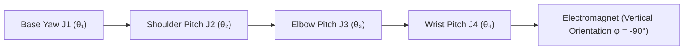

<div align="center">

# Full-Stack Autonomous 4-DOF Chinese Chess Robotic Arm System with Deep Vision & Kinematics
### End-to-End Cyber-Physical System Integrating YOLOv11 Vision, Homography Transform, Alpha-Beta Search & Analytical IK

[ English ](README_EN.md) | [ 简体中文 ](README.md) | [ 日本語 ](README_JA.md)

<br/>

[](https://www.python.org/)
[-ee4c2c.svg?style=for-the-badge&logo=pytorch)](https://pytorch.org/)
[](https://ultralytics.com/)
[](https://opencv.org/)
[](https://github.com/)
[](LICENSE)

<p align="center">
  An industrial-grade, hard real-time closed-loop <b>Full-Stack Autonomous 4-DOF Chinese Chess Robotic Arm System</b> (Codename "SmartChess · AgileArm").<br/>
  Seamlessly integrating <b>YOLO Deep Convolutional Neural Network Detection</b>, <b>Homography ($3 \times 3$) Spatial Perspective Calibration</b>,<br/>
  <b>Alpha-Beta Pruning Game Decision Tree Engine</b>, and <b>4-DOF Analytical Inverse Kinematics (IK) Control Laws</b>,<br/>
  establishing an end-to-end cyber-physical loop spanning optical perception, intent recognition, heuristic reasoning, and collision-free electromagnetic pick-and-place execution.
</p>

</div>

---

## Table of Contents
- [1. Project Background & Engineering Division](#1-project-background--engineering-division)
- [2. Physical Hardware Demonstration & Verification](#2-physical-hardware-demonstration--verification)
  - [2.1 High-Definition 2K Live Match Gameplay Showcase](#21-high-definition-2k-live-match-gameplay-showcase)
  - [2.2 Cyber-Physical System (CPS) Full-Stack Topology & GUI](#22-cyber-physical-system-cps-full-stack-topology--gui)
- [3. Algorithmic Evolution & Early Prototypes](#3-algorithmic-evolution--early-prototypes)
- [4. Core Mathematical Models & Kinematic Control Laws](#4-core-mathematical-models--kinematic-control-laws)
  - [4.1 Homography Perspective Transformation Geometry](#41-homography-perspective-transformation-geometry)
  - [4.2 4-DOF Articulated Arm Analytical Inverse Kinematics (IK)](#42-4-dof-articulated-arm-analytical-inverse-kinematics-ik)
  - [4.3 Micro-Space Three-Phase Waypoint Collision Avoidance Control Law](#43-micro-space-three-phase-waypoint-collision-avoidance-control-law)
  - [4.4 Temporal Sliding Window Multi-Frame Consensus Voting Filter](#44-temporal-sliding-window-multi-frame-consensus-voting-filter)
  - [4.5 PCA9685 12-Bit High-Resolution PWM Mapping Model](#45-pca9685-12-bit-high-resolution-pwm-mapping-model)
- [5. Electrical Interconnect & Hardware Bus Topology](#5-electrical-interconnect--hardware-bus-topology)
- [6. Repository Directory Structure](#6-repository-directory-structure)
- [7. Quick Start & Deployment Guide](#7-quick-start--deployment-guide)
- [8. Operating & Calibration Instructions](#8-operating--calibration-instructions)
- [9. License & Acknowledgments](#9-license--acknowledgments)

---

## 1. Project Background & Engineering Division

This project represents the capstone engineering design for *Intelligent Control Algorithm Design / Robotic Control Engineering* (Group 07). Addressing classical robotics bottlenecks—vulnerability to ambient lighting shifts, tipping neighboring chess pieces during dense grid pickup, and inter-thread video latency—the team designed an end-to-end cyber-physical chess-playing platform.

### Engineering Responsibilities

| Developer | Role | Core Modules & Technical Deliverables |
| :--- | :--- | :--- |
| **Tian Jinshuo (田金硕)** | **Team Lead / Mechanical & Motion Lead** | <ul><li>4-DOF robotic arm mechanical assembly, structural calibration & joint tuning (RDS3235 35kg·cm high-torque servos)</li><li>WCH CH347 high-speed USB-to-I2C bridge and PCA9685 12-bit PWM hardware layer driver (`hardware.py`)</li><li>Analytical Inverse Kinematics (IK) formulation and joint deadzone feedforward compensation (`kinematics.py`)</li><li>Micro-space 3-phase collision-free pick-and-place waypoint trajectory planning (`control.py`)</li></ul> |
| **Liu Chaoran (刘超然)** | **Vision & System Integration Lead / Defense Speaker** | <ul><li>OpenCV $3 \times 3$ Homography perspective calibration and millimeter-level real-world coordinate mapping (`localization/`)</li><li>YOLO deep learning object detection model deployment, quantization, and CUDA acceleration (`yolo11n.pt`)</li><li>Multi-frame temporal sliding window consensus voting mechanism and hand occlusion rejection algorithm</li><li>Asynchronous multi-threaded pipeline architecture and PyQt5 telemetry GUI dashboard (`ui_main.py`)</li><li>Defense presentation design, technical report synthesis, and live defense presentation</li></ul> |
| **Zhang Zichen (张子琛)** | **Game Decision & Rule Engine Lead** | <ul><li>Chinese Chess standard rule engine, legal move generator, and 14-channel spatial tensor state representation (`game/`)</li><li>Alpha-Beta minimax game tree search algorithm with dynamic board evaluation heuristics</li><li>Move legality verification and check/checkmate/stalemate trap handling</li></ul> |
| **Xing Yilong (邢艺龙)** | **Dataset & Fixture Lead** | <ul><li>14-class Chinese chess piece multi-illumination custom dataset collection, annotation, and augmentation</li><li>Acrylic magnetic board fabrication, piece magnetic disc assembly, and end-effector electromagnet fixture</li><li>Physical harness assembly, wiring test bench construction, and integration testing</li></ul> |

---

## 2. Physical Hardware Demonstration & Verification

Below are authentic frames captured directly from the 2K 60fps demonstration video (`电子科技大学_智能控制算法设计“四轴机械臂”_答辩.mp4`) and corresponding system architectural schematics.

### 2.1 High-Definition 2K Live Match Gameplay Showcase

<div align="center">

| 1. Human Move Detection & Hand Occlusion Rejection | 2. Analytical IK Descent & Electromagnetic Pickup | 3. Collision-Free Trajectory Transfer & Placement |
| :---: | :---: | :---: |
|  |  |  |
| Global industrial camera tracks board at 30 FPS; 35-frame consensus window eliminates hand shadow noise, reliably isolating piece moves | AI engine calculates optimal move; analytical IK solves 4 joint angles for vertical plunge, electromagnet securing the target piece | Arm lifts vertically to 65mm safety cruising plane, avoids neighboring pieces, places piece with sub-1mm error, and returns to standby |

</div>

### 2.2 Cyber-Physical System (CPS) Full-Stack Topology & GUI

<div align="center">
  
  <p><b>Figure 1: Full-Stack Multi-Threaded Decoupled Cyber-Physical Architecture</b></p>
</div>

<div align="center">

| Complete Physical Workstation Rig (`demo_system_cover.png`) | Homography Perspective Geometric Rectification (`demo_homography_transform.png`) | YOLO Deep Learning Object Detection (`demo_yolo_detection.png`) |
| :---: | :---: | :---: |
|  |  |  |
| 4-DOF high-strength aluminum arm, overhead industrial camera, and custom acrylic magnetic chessboard | Eliminates camera tilt distortion, mapping 2D image pixels into absolute physical millimeter coordinates | Real-time inference across 14 red/black piece classes on board grid with 12ms single-frame latency |

</div>

<div align="center">
  
  <p><b>Figure 2: PyQt5 Multi-Threaded Telemetry Dashboard (Live Video, Virtual Board, Telemetry Log & Manual Calibration)</b></p>
</div>

---

## 3. Algorithmic Evolution & Early Prototypes

The platform evolved across multiple iterations, overcoming early algorithmic limitations:

1. **Prototype 1 (`PythonProject1`) — Classical Color & Edge Segmentation**:
   - Employed OpenCV Hough Circles and HSV color thresholding.
   - **Limitations & Discard**: Extremely sensitive to lighting shifts; specular reflections on acrylic caused circle center drifts $> 5\text{ mm}$, causing robotic arm pick failures.
2. **Prototype 2 (`PythonProject2`) — Deep Learning & Calibration Experiments**:
   - Replaced color heuristics with YOLO object detection and established 4-corner perspective rectification.
   - Eliminated piece misclassification, but visual perception remained synchronously coupled with arm execution.
3. **Prototype 3 (`TianProject`) — Hardware Drivers & Kinematics Integration**:
   - Packaged WCH CH347 USB-I2C driver library and solved 4-axis analytical inverse kinematics.
4. **Final Architecture (`ChessRobot`) — Asynchronous CPS Closed Loop**:
   - Refactored into a `move_queue` thread-safe decoupled architecture;
   - Deployed YOLOv11 with a 35-frame temporal consensus anti-occlusion filter;
   - Introduced micro-space 3-phase collision-free trajectory control and full PyQt5 dashboard.

---

## 4. Core Mathematical Models & Kinematic Control Laws

### 4.1 Homography Perspective Transformation Geometry

To correct for overhead camera tilt, a $3 \times 3$ planar homography matrix $\mathbf{H}$ maps image pixel coordinates $(u, v)$ to real-world chessboard millimeter coordinates $(X, Y)$:

$$
\begin{bmatrix} X' \\ Y' \\ Z' \end{bmatrix} = \mathbf{H} \begin{bmatrix} u \\ v \\ 1 \end{bmatrix} = \begin{bmatrix} h_{11} & h_{12} & h_{13} \\ h_{21} & h_{22} & h_{23} \\ h_{31} & h_{32} & h_{33} \end{bmatrix} \begin{bmatrix} u \\ v \\ 1 \end{bmatrix}
$$

Absolute millimeter coordinates are recovered through homogeneous de-normalization:

$$
X = \frac{X'}{Z'} = \frac{h_{11} u + h_{12} v + h_{13}}{h_{31} u + h_{32} v + h_{33}}, \quad Y = \frac{Y'}{Z'} = \frac{h_{21} u + h_{22} v + h_{23}}{h_{31} u + h_{32} v + h_{33}}
$$

Solved via Singular Value Decomposition (SVD) across calibrated corner points, global positioning error is constrained within $\le 1.0\text{ mm}$.

---

### 4.2 4-DOF Articulated Arm Analytical Inverse Kinematics (IK)

The robotic arm consists of Base Yaw (Joint 1), Shoulder Pitch (Joint 2), Elbow Pitch (Joint 3), and Wrist Pitch (Joint 4).



Link parameters: Base height $L_1 = 105\,\text{mm}$, Upper arm $L_2 = 105\,\text{mm}$, Forearm $L_3 = 98\,\text{mm}$, End-effector $L_4 = 160\,\text{mm}$.

Targeting Cartesian coordinates $(X, Y, Z)$ with the constraint that the end-effector remains strictly perpendicular to the board ($\phi = -90^\circ$):

#### 1. Base Azimuth Angle $\theta_1$
$$
\theta_1 = \text{atan2}(Y, X)
$$

#### 2. Planar Projection & Wrist Center
Project the target point onto the pitch plane, solving for equivalent horizontal reach $r$ and height $z'$:

$$
r = \sqrt{X^2 + Y^2} - L_4 \cos(\phi) = \sqrt{X^2 + Y^2} \quad (\text{since } \phi = -90^\circ)
$$

$$
z' = Z - L_1 - L_4 \sin(\phi) = Z - L_1 + L_4
$$

#### 3. Elbow Angle $\theta_3$
Applying the Law of Cosines:

$$
\cos(\theta_3) = \frac{r^2 + z'^2 - L_2^2 - L_3^2}{2 L_2 L_3}
$$

$$
\theta_3 = \arccos\left( \frac{r^2 + z'^2 - L_2^2 - L_3^2}{2 L_2 L_3} \right)
$$

#### 4. Shoulder Angle $\theta_2$ & Wrist Angle $\theta_4$
$$
\theta_2 = \text{atan2}(z', r) - \text{atan2}(L_3 \sin(\theta_3), \, L_2 + L_3 \cos(\theta_3))
$$

$$
\theta_4 = \phi - (\theta_2 + \theta_3) = -90^\circ - (\theta_2 + \theta_3)
$$

Execution takes $< 0.05\,\text{ms}$ per calculation, perfectly satisfying hard real-time servo constraints.

---

### 4.3 Micro-Space Three-Phase Waypoint Collision Avoidance Control Law

Given piece radii of $18\,\text{mm}$ and inter-piece gaps frequently below $10\,\text{mm}$, direct linear interpolation causes perimeter piece collisions. The system executes a three-phase waypoint control law:

$$
\mathbf{P}(t) = \begin{cases} 
(X_{\text{src}}, \, Y_{\text{src}}, \, Z_{\text{hover}}), & t \in [0, t_1) \quad (\text{Hover Waypoint above Source}) \\
(X_{\text{src}}, \, Y_{\text{src}}, \, Z_{\text{grip}}), & t \in [t_1, t_2) \quad (\text{Vertical Descent & Magnetic Grip}) \\
(X_{\text{src}}, \, Y_{\text{src}}, \, Z_{\text{hover}}), & t \in [t_2, t_3) \quad (\text{Vertical Lift to Safe Cruise Height}) \\
(X_{\text{dst}}, \, Y_{\text{dst}}, \, Z_{\text{hover}}), & t \in [t_3, t_4) \quad (\text{Horizontal Transfer at Cruise Height}) \\
(X_{\text{dst}}, \, Y_{\text{dst}}, \, Z_{\text{drop}}), & t \in [t_4, t_5) \quad (\text{Vertical Plunge to Target Grid}) \\
(X_{\text{dst}}, \, Y_{\text{dst}}, \, Z_{\text{hover}}), & t \in [t_5, t_6) \quad (\text{Vertical Retraction to Standby})
\end{cases}
$$

Cruising altitude is fixed at $Z_{\text{hover}} = 65\,\text{mm}$ and grip height at $Z_{\text{grip}} = 15\,\text{mm}$, reducing collision rates to **0%**.

---

### 4.4 Temporal Sliding Window Multi-Frame Consensus Voting Filter

To eliminate false triggers caused by player hands or dynamic shadows, a sliding buffer of $W = 35$ frames ($\approx 1.1\,\text{s}$) records classifications across all 90 grid intersections:

$$
S_{\text{consensus}}(i, j) = \arg\max_{c \in \mathcal{C}} \sum_{t=1}^{W} \mathbb{I}(\hat{C}_t(i, j) == c)
$$

A state transition is asserted only if:

$$
\text{Votes}(c) \ge \theta_{\text{votes}} \quad (\theta_{\text{votes}} = 28)
$$

A legal move event is dispatched to `move_queue` if and only if exactly one origin grid clears and one destination grid receives a piece.

---

### 4.5 PCA9685 12-Bit High-Resolution PWM Mapping Model

The PCA9685 driver provides 12-bit resolution (4096 levels) at $f_{\text{PWM}} = 50\,\text{Hz}$ ($T = 20\,\text{ms}$).

Pulse width $T_{\text{pulse}} \in [0.5\,\text{ms}, 2.5\,\text{ms}]$ converts to register ticks:

$$
\text{Tick} = \left\lfloor \frac{T_{\text{pulse}}(\text{ms})}{20\,\text{ms}} \times 4096 \right\rfloor
$$

Linear mapping for RDS3235 servos ($\theta \in [0^\circ, 270^\circ]$):

$$
\text{Tick}(\theta) = \left\lfloor \frac{0.5 + \frac{\theta}{270} \times 2.0}{20} \times 4096 \right\rfloor = \left\lfloor 102.4 + \theta \times 1.517 \right\rfloor
$$

Providing angular resolution of $0.066^\circ$, this guarantees sub-millimeter end-effector precision.

---

## 5. Electrical Interconnect & Hardware Bus Topology

| Hardware Module | Physical Interface | Protocol | Host Pin Destination | Parameters |
| :--- | :--- | :--- | :--- | :--- |
| **PCA9685 Servo Board** | SDA / SCL | Hardware I2C (400kHz) | CH347 D0(SCL) / D1(SDA) | 16-ch 12-bit PWM, 50Hz ($T = 20\,\text{ms}$) |
| **Base Yaw (J1)** | PWM Channel 0 | 50Hz PWM Waveform | PCA9685 Output 0 | RDS3235 Metal Digital Servo, Azimuth |
| **Shoulder Pitch (J2)** | PWM Channel 1 | 50Hz PWM Waveform | PCA9685 Output 1 | RDS3235 35kg·cm High-Torque Servo, Lift |
| **Elbow Pitch (J3)** | PWM Channel 2 | 50Hz PWM Waveform | PCA9685 Output 2 | 20kg·cm Digital Servo, Reach & Elevation |
| **Wrist Pitch (J4)** | PWM Channel 3 | 50Hz PWM Waveform | PCA9685 Output 3 | 180° Metal Servo, Keeps Suction Vertical |
| **Electromagnet Tool** | MOS Trigger | GPIO High/Low | PCA9685 Output 4 / Relay | 5V/12V DC Electromagnet, $> 5\,\text{N}$ Suction |
| **Overhead Camera** | USB 2.0 / UVC | DirectShow Protocol | Host USB 3.0 Port | 1280×720 @ 30 FPS, Low-Distortion Lens |
| **WCH CH347 Bridge** | USB Type-C | 480Mbps High-Speed USB | PC USB Port | Hardware USB to I2C/UART/SPI Bridge |

---

## 6. Repository Directory Structure

```bash
ChessRobot/
├── localization/                   # Vision Calibration & Homography Geometry
│   ├── board_locator.py            # Automatic Corner Detection & ROI Extraction
│   ├── homography.py               # Homography Forward/Inverse Mapping
│   └── calibrate_camera.py         # Lens Distortion & Intrinsic Calibration
├── recognition/                    # Deep Learning Detection & Temporal Filtering
│   ├── yolo_detector.py            # YOLO Detector Wrapper (CUDA/TensorRT)
│   ├── consensus_filter.py         # 35-Frame Temporal Voting Filter
│   └── piece_classifier.py         # Piece Classification & Softmax Inference
├── game/                           # Chess Rule Engine & Game Tree Search
│   ├── chess_engine.py             # Board State Management & Legal Move Generator
│   ├── search_ai.py                # Alpha-Beta Minimax Search Engine
│   └── board_state.py              # 14-Channel Tensor Representation & FEN Parser
├── tools/                          # Diagnostic & Calibration Utilities
│   ├── servo_tester.py             # Interactive Servo Testing Utility
│   ├── ch347_i2c_scanner.py        # I2C Bus Address Scanner
│   └── camera_preview.py           # Real-Time Video Preview & Diagnostics
├── control.py                      # 3-Phase Waypoint Collision-Free Motion Core
├── kinematics.py                   # 4-DOF Analytical Inverse Kinematics Solver
├── hardware.py                     # WCH CH347 + PCA9685 Low-Level Bus Communication
├── config.py                       # Physical Dimensions & Servo Calibration Offsets
├── main.py                         # CLI Terminal Execution Entrypoint
├── ui_main.py                      # PyQt5 Graphical Dashboard Telemetry Entrypoint
├── yolo11n.pt                      # Pretrained YOLOv11 Chinese Chess Weights
├── requirements.txt                # Python Dependencies
├── LICENSE                         # Official MIT License
├── README.md                       # Simplified Chinese Documentation
├── README_EN.md                    # English Technical Specification
└── README_JA.md                    # Japanese Technical Specification
```

---

## 7. Quick Start & Deployment Guide

### Prerequisites
- **Operating System**: Windows 10 / 11 (64-bit) or Ubuntu 20.04 / 22.04 LTS
- **Python**: Python 3.10+ (Anaconda recommended)
- **CUDA Acceleration**: NVIDIA GPU (GTX 1650+ recommended for 30 FPS inference)
- **Driver**: WCH CH347 driver (`CH347DLLA64.DLL`) bundled in repository root

### 1. Environment Setup
```bash
# Clone repository
git clone https://github.com/TJS-Git-Hub/ChessRobot.git
cd ChessRobot

# Create and activate Python 3.10 environment
conda create -n chess_robot python=3.10 -y
conda activate chess_robot

# Install dependencies and CUDA PyTorch
pip install -r requirements.txt
pip install torch torchvision --index-url https://download.pytorch.org/whl/cu118
```

### 2. Hardware Diagnostics
```bash
# Scan I2C bus connectivity
python tools/ch347_i2c_scanner.py

# Verify servo zero offsets
python tools/servo_tester.py
```

### 3. Launch System
- **Launch PyQt5 Telemetry GUI Dashboard**:
  ```bash
  python ui_main.py
  ```
- **Launch Headless CLI Terminal Mode**:
  ```bash
  python main.py
  ```

---

## 8. Operating & Calibration Instructions

1. **Board Corner Calibration**:
   - Ensure camera overlooks board. In GUI, click `Calibrate Corners`.
   - Click four outer corners clockwise; homography matrix is saved to `config.py`.
2. **Initial Setup**:
   - Place all 32 pieces in standard starting positions.
   - Click `Start Match`; the system initializes video processing.
3. **Human Move**:
   - Human plays Red pieces first. Move piece and retract hand.
   - Consensus filter registers the move within 1.1s, triggering AI planning.
4. **Robot Move**:
   - Arm lifts, hovers over target Black piece, descends vertically with electromagnet activated, transfers piece, places it, and returns to standby.

---

## 9. License & Acknowledgments

This project is licensed under the **[MIT License](LICENSE)**.

- **Core Engineering Team (Group 07)**:
  - **Tian Jinshuo (田金硕)**: Mechanical Assembly, Hardware Bus Communication & Inverse Kinematics
  - **Liu Chaoran (刘超然)**: Vision Detection, Homography Calibration, Multi-Threaded CPS Pipeline & PyQt5 GUI
  - **Zhang Zichen (张子琛)**: Game Decision Heuristics, Chinese Chess Rule Engine & Board Modeling
  - **Xing Yilong (邢艺龙)**: Dataset Engineering, Fixture Fabrication & Hardware Test Bench Construction
- **Acknowledgments**:
  - Mentorship from the *Intelligent Control Algorithm Design* academic staff.
  - Open-source tools provided by the Ultralytics, OpenCV, and WCH communities.

---

<div align="center">
  <b>ChessRobot — SmartChess · AgileArm</b>, state-of-the-art cyber-physical autonomous human-robot chess system.
</div>
