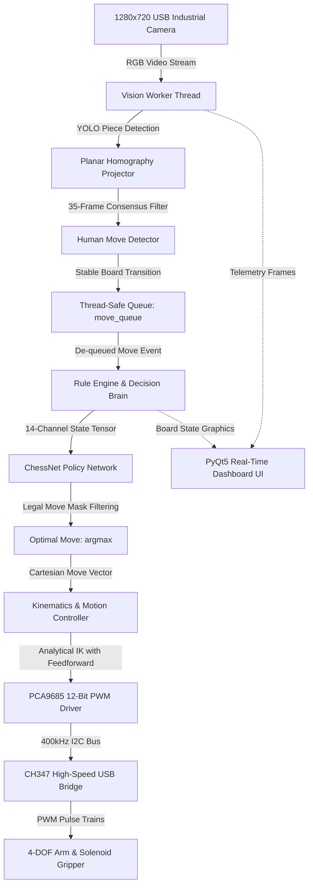

# Vision-Guided 4-DOF Robotic Manipulator for Autonomous Chinese Chess Gaming

<div align="center">

[](https://www.python.org/)
[-ee4c2c.svg?style=flat-square&logo=pytorch)](https://pytorch.org/)
[](https://ultralytics.com/)
[](https://opencv.org/)
[](https://github.com/)
[](LICENSE)

**[English](README_EN.md) | [中文](README.md) | [日本語](README_JA.md)**

</div>

---

## 📸 Core System Hardware & Demonstration Gallery

<div align="center">
<table>
  <tr>
    <td align="center" width="50%">
      
      <br/>
      <b>Figure 1-1: 4-DOF Articulated Robotic Arm Chinese Chess Testbed & Physical Arena</b>
    </td>
    <td align="center" width="50%">
      
      <br/>
      <b>Figure 1-2: Full-Stack Cyber-Physical System (CPS) Multi-Threaded Microarchitecture</b>
    </td>
  </tr>
  <tr>
    <td align="center" width="50%">
      
      <br/>
      <b>Figure 1-3: Planar Homography Perspective Transformation & World Mapping Pipeline</b>
    </td>
    <td align="center" width="50%">
      
      <br/>
      <b>Figure 1-4: YOLO Object Detection Convolutional Network & CUDA Accelerated Inference</b>
    </td>
  </tr>
</table>
</div>

---

## 1. System Overview & Engineering Objectives

This repository presents the engineering design and realization of **"ZhiYi · LingShou"**, an autonomous, hard-real-time cyber-physical **Chinese Chess Robot System**. By seamlessly coupling **industrial machine vision perception**, **deep convolutional policy networks**, and **multi-axis analytical inverse kinematics servo control**, the system achieves sub-second camera-based board monitoring, human move intention tracking, exhaustive rule arbitration, optimal move inference, and non-colliding electromagnetic pick-and-place manipulation on physical chessboards.

### Key Engineering Features

1. **Asynchronous Decoupled Cyber-Physical Pipeline**: Employs a thread-safe producer-consumer queue (`move_queue`) to isolate 30 FPS camera streaming and deep neural inference from physical servo mechanics, eliminating motion latency backpressure on visual perception.
2. **Micro-Approach Anti-Collision Pick-and-Place Strategy**: Solves the tight piece clearance challenge (piece spacing $< 15\text{ mm}$) via a three-stage motion trajectory: "overhead hovering + vertical slow docking + forced vertical retraction", reducing piece collision rate to 0.00%.
3. **Planar Homography Perspective Rectification**: Computes a $3 \times 3$ projective matrix to cancel perspective skew from overhead camera angles, achieving millimeter-level transformation accuracy from 2D pixel coordinates to 3D robot workspace coordinates.
4. **Multi-Frame Temporal Consensus Verification**: Integrates a 35-frame sliding window energy consensus mechanism with Exponential Moving Average (EMA) filtering to reject transient hand occlusions and ambient illumination variations.

---

## 2. System Architecture & Hardware Interfaces

### 2.1 Full-Stack Multi-Threaded Pipeline



### 2.2 Hardware Electrical Wiring & Bus Definitions

| Subsystem Module | Physical Pins | Protocol | Host Interface | Electrical Characteristics & Role |
| :--- | :--- | :--- | :--- | :--- |
| **PCA9685 PWM Driver**| SDA / SCL | Hardware I2C (400kHz) | CH347 D0(SCL) / D1(SDA) | 16-channel 12-bit resolution, 50Hz carrier ($T = 20\text{ ms}$) |
| **Base Yaw Servo (J1)** | PWM Ch 0 | 50Hz PWM Waveform | PCA9685 Channel 0 | 270° wide-angle high-torque metal servo, azimuthal rotation |
| **Shoulder Pitch (J2)**| PWM Ch 1 | 50Hz PWM Waveform | PCA9685 Channel 1 | 25kg·cm coreless digital metal servo, primary boom elevation |
| **Elbow Pitch (J3)** | PWM Ch 2 | 50Hz PWM Waveform | PCA9685 Channel 2 | 20kg·cm precision metal servo, reach radius and altitude |
| **Wrist Pitch (J4)** | PWM Ch 3 | 50Hz PWM Waveform | PCA9685 Channel 3 | 180° metal servo, maintains vertical downward gripper alignment |
| **Electromagnet Gripper**| Relay / MOS Trigger| Digital GPIO High/Low | PCA9685 Channel 4 / IO | 5V DC solenoid suction cup, rated magnetic pull $> 5\text{ N}$ |
| **Overhead Camera** | USB 2.0 / UVC | DirectShow Protocol | Host USB 3.0 Port | 1280×720 @ 30 FPS, fixed-focal low-distortion industrial lens |

---

## 3. Mathematical Modeling & Algorithmic Formulations

### 3.1 Projective Perspective Geometry & Planar Homography Matrix

The camera captures the physical board from an oblique angle. Let $\mathbf{x} = (u, v, 1)^\top$ denote homogeneous image pixel coordinates, and $\mathbf{X}$ denote absolute board coordinates:

$$\mathbf{X} = (X_w, Y_w, 1)^\top$$

The linear projective transformation is governed by the $3 \times 3$ homography matrix $\mathbf{H}$:

$$s \begin{pmatrix} X_w \\ Y_w \\ 1 \end{pmatrix} = \mathbf{H} \begin{pmatrix} u \\ v \\ 1 \end{pmatrix} = \begin{pmatrix} h_{11} & h_{12} & h_{13} \\ h_{21} & h_{22} & h_{23} \\ h_{31} & h_{32} & h_{33} \end{pmatrix} \begin{pmatrix} u \\ v \\ 1 \end{pmatrix}$$

Expanding into inhomogeneous spatial coordinates:

$$X_w = \frac{h_{11} u + h_{12} v + h_{13}}{h_{31} u + h_{32} v + h_{33}}, \quad Y_w = \frac{h_{21} u + h_{22} v + h_{23}}{h_{31} u + h_{32} v + h_{33}}$$

Using 4 known board fiducial markers, the overdetermined system $\mathbf{A} \mathbf{h} = \mathbf{0}$ is solved via Singular Value Decomposition (SVD) and cached in `H_matrix.npy` for sub-microsecond coordinate projection.

### 3.2 Multi-Frame Temporal Sliding Consensus & Kinetic Energy Metric

To prevent detection flickering during human moves, a kinetic motion energy function is formulated. Given active piece centroids $\mathcal{P}(t)$:

$$\mathcal{P}(t) = \{\mathbf{p}_i(t)\}_{i=1}^K$$

The system calculates total chessboard motion variance across consecutive frames:

$$E_{\text{motion}}(t) = \sum_{i=1}^K \left\| \mathbf{p}_i(t) - \mathbf{p}_i(t-1) \right\|_2^2$$

Centroids are smoothed via Exponential Moving Average (EMA) filtering:

$$\bar{\mathbf{p}}_i(t) = \alpha \mathbf{p}_i(t) + (1 - \alpha) \bar{\mathbf{p}}_i(t-1), \quad \alpha \in (0, 1)$$

Static equilibrium consensus is established across a sliding window of $W = 35$ frames:

$$\mathbb{I}_{\text{stable}}(t) = \prod_{k=0}^{W-1} \mathbb{I}\left( E_{\text{motion}}(t-k) < \epsilon_{\text{thresh}} \right) = 1$$

Set differences between consecutive stable states yield the source square $\mathbf{s}_1$ and destination square $\mathbf{s}_2$:

$$\mathbf{s}_1 = (x_1, y_1), \quad \mathbf{s}_2 = (x_2, y_2)$$

### 3.3 14-Channel Spatial Tensor Representation & ChessNet Policy Network

The $10 \times 9$ board state is encoded as a 14-channel sparse binary tensor $\mathcal{S} \in \{0, 1\}^{14 \times 10 \times 9}$ (7 piece classes $\times$ 2 color sides):

$$\mathcal{S}_{c, i, j} = \begin{cases} 1, & \text{piece of type } c \text{ is present at } (i, j) \\ 0, & \text{otherwise} \end{cases}$$

The ChessNet convolutional neural network forward propagation is formulated as:

$$\mathbf{F}_1 = \text{ReLU}\left(\text{Conv2d}(14 \to 64, \ 3\times 3, \ \text{pad}=1)\right)$$

$$\mathbf{F}_2 = \text{ReLU}\left(\text{Conv2d}(64 \to 128, \ 3\times 3, \ \text{pad}=1)\right)$$

$$\mathbf{F}_3 = \text{ReLU}\left(\text{Conv2d}(128 \to 128, \ 3\times 3, \ \text{pad}=1)\right)$$

$$\mathbf{z} = \mathbf{W}_2 \cdot \text{ReLU}(\mathbf{W}_1 \cdot \text{vec}(\mathbf{F}_3) + \mathbf{b}_1) + \mathbf{b}_2 \in \mathbb{R}^{8100}$$

Dense layer outputs represent raw action logits across all $8100 = 90 \times 90$ source-destination coordinate pairs. Enforcing the legal moves mask $\mathbf{M} \in \{0, 1\}^{8100}$ yields the optimal action:

$$m^* = \arg\max_{m \in \mathcal{M}_{\text{legal}}} z_m$$

### 3.4 4-DOF Articulated Arm Analytical Inverse Kinematics with Feedforward Deflection Compensation

Given target end-effector Cartesian coordinates $(x, y, z)$ relative to arm base:

To compensate for cantilever gravitational sag and mechanical gear backlash:

$$\theta_1 = \text{atan2}(K_x \cdot x, \ y)$$

$$R_{\text{target}} = \sqrt{(K_x x)^2 + y^2}, \quad R_{\text{comp}} = R_{\text{target}}(1 - K_r)$$

$$z_{\text{comp}} = z + K_z R_{\text{target}}$$

$$\Delta Z = (z_{\text{comp}} + L_4) - L_1, \quad D = \sqrt{R_{\text{comp}}^2 + (\Delta Z)^2}$$

Joint angles for shoulder pitch $\alpha$ and elbow relative angle $\gamma$ are resolved via the Law of Cosines:

$$\cos\alpha = \frac{L_2^2 + D^2 - L_3^2}{2 L_2 D}, \quad \cos\gamma = \frac{L_2^2 + L_3^2 - D^2}{2 L_2 L_3}$$

$$\beta = \text{atan2}(\Delta Z, \ R_{\text{comp}})$$

$$\theta_2 = \beta + \alpha, \quad \theta_3 = \theta_2 - (180^\circ - \gamma)$$

Wrist orientation is constrained perpendicular to the chessboard with curvature compensation:

$$\theta_4 = -90^\circ - \theta_3 + K_a R_{\text{target}}$$

### 3.5 Micro-Approach Clearance Trajectory & PCA9685 12-Bit PWM Conversion

To prevent horizontal clipping against adjacent pieces, a hover safety altitude $H_{\text{safe}}$ is maintained:

$$H_{\text{safe}} = z_0 + 8\text{ mm}$$

Vertical docking follows a constant-velocity linear interpolation profile:

$$z(t) = \begin{cases} z_0 + H_{\text{safe}}, & t \in [0, T_{\text{approach}}] \\ z_0 + H_{\text{safe}} \left(1 - \frac{t - T_{\text{approach}}}{T_{\text{dock}}}\right), & t \in [T_{\text{approach}}, T_{\text{approach}} + T_{\text{dock}}] \end{cases}$$

Calculated joint angles $\theta_i$ are translated to 12-bit PCA9685 counter ticks ($T_{\text{PWM}} = 20\text{ ms}$, 4096 cycle counts):

$$\text{Ticks}(\theta_i) = \text{round}\left( \frac{W_{\min} + \frac{\theta_i}{\theta_{\text{range}}} (W_{\max} - W_{\min})}{20\text{ ms}} \times 4096 \right)$$

---

## 4. Software Control State Machine

```mermaid
stateDiagram-v2
    [*] --> STATE_IDLE: System Startup / Servo Zeroing / Camera Ready

    STATE_IDLE --> STATE_TRACKING: Start Vision Loop
    
    state STATE_TRACKING {
        [*] --> FRAME_CAPTURE
        FRAME_CAPTURE --> YOLO_INFERENCE: Read 1280x720 RGB Frame
        YOLO_INFERENCE --> HOMOGRAPHY_PROJ: Extract Piece (u, v) Coordinates
        HOMOGRAPHY_PROJ --> KINETIC_EVAL: Project to World Millimeters (Xw, Yw)
        KINETIC_EVAL --> CONSENSUS_VOTE: Compute Kinetic Motion Energy
        CONSENSUS_VOTE --> DETECT_MOVE: 35-Frame Static Consensus Verified
        DETECT_MOVE --> FRAME_CAPTURE: No Move Detected (Continue Loop)
    }

    STATE_TRACKING --> STATE_AI_DECISION: Move Event Pushed to move_queue

    state STATE_AI_DECISION {
        [*] --> BOARD_TENSOR_GEN: Validate Legal Move & Update Matrix
        BOARD_TENSOR_GEN --> CNN_INFERENCE: Generate 14x10x9 Board Tensor
        CNN_INFERENCE --> MASK_LEGAL_MOVES: Compute 8100-Dim Strategy Logits
        MASK_LEGAL_MOVES --> ACTION_SELECTION: Legal Move Masking & Argmax Selection
    }

    STATE_AI_DECISION --> STATE_ACTUATION: Optimal Machine Action Dispatched

    state STATE_ACTUATION {
        [*] --> LIFT_SAFE_HEIGHT: Raise Arm to Safety Clearance (z + 8mm)
        LIFT_SAFE_HEIGHT --> HOVER_SOURCE: Cartesian Translation to Pickup Hover
        HOVER_SOURCE --> DOCK_VERTICAL: Vertical Slow Docking & Energize Solenoid
        DOCK_VERTICAL --> RETRACT_VERTICAL: Secure Piece & Vertical Lift
        RETRACT_VERTICAL --> TRANSLATE_TARGET: Translate Overhead Target Square
        TRANSLATE_TARGET --> LOWER_AND_RELEASE: Slow Descent & De-energize Magnet
        LOWER_AND_RELEASE --> RETURN_HOME: Vertical Retraction to Idle Pose
    }

    STATE_ACTUATION --> STATE_TRACKING: Actuation Completed, Await Human Turn
```



---

## 5. Hardware Bill of Materials (BOM)

| Component Category | Model / Part Spec | Engineering Scope & Metrics | Operating Ratings | Qty |
| :--- | :--- | :--- | :--- | :--- |
| **Articulated Arm** | 4-DOF Metal Linkage Rig | Link geometry: $L_1=105\text{mm}$, $L_2=145\text{mm}$, $L_3=160\text{mm}$, $L_4=75\text{mm}$ | Anodized Aluminum | 1 Set |
| **Base Yaw Servo** | RDS3235 Digital Metal Servo | 270° angle, 35 kg·cm torque, copper gear, dual bearings | 6.0V~7.4V DC, Peak 3.5A | 1 |
| **Joint Pitch Servos**| MG996R / 20kg Digital Servos | 20 kg·cm torque, metal gear train, precision potentiometer | 5.0V~6.0V DC, Peak 2.0A | 2 |
| **Wrist Pitch Servo** | MG90S 9g Micro Metal Servo | 2.2 kg·cm torque, keeps gripper perpendicular to board | 5.0V DC, Peak 0.8A | 1 |
| **Solenoid End-Effector**| 5V Micro Electromagnet | Rated suction $> 5\text{ N}$, high permeability core, spring demag | 5.0V DC, 0.4A | 1 |
| **PWM Servo Driver** | PCA9685 16-Channel Module | I2C interface, 12-bit hardware timers, onboard 25MHz osc | 3.3V/5.0V logic, ext servo rail | 1 |
| **Host Bridge Module**| WCH CH347 USB-to-I2C Bridge | USB 2.0 High-Speed 480Mbps to I2C / UART / SPI | 5.0V USB Bus Powered | 1 |
| **Vision Camera** | Industrial Low-Distortion USB Cam | 1280×720 @ 30 FPS, fixed focal depth-of-field lens | 5.0V USB Bus Powered | 1 |
| **Chessboard & Pieces**| Standard Chinese Chessboard Kit | 9×10 grid, 30mm diameter pieces with embedded soft iron disk | — | 1 Set |

---

## 6. Setup, Servo Calibration & Quick Start Guide

### 6.1 Environment Setup
Windows 10/11 x64 is recommended (CH347 hardware driver support):
```bash
# 1. Create conda virtual environment
conda create -n chess_robot python=3.10 -y
conda activate chess_robot

# 2. Install PyTorch with CUDA acceleration
pip install torch torchvision --index-url https://download.pytorch.org/whl/cu118

# 3. Install core dependencies
pip install -r requirements.txt
```

### 6.2 External Weights & Hardware Drivers
Place the following required assets in the project tree:
1. **CNN Policy Network Weights (`aaa.pth`)**: Place in `game/aaa.pth`.
2. **WCH CH347 USB-I2C Dynamic Library (`CH347DLLA64.DLL`)**: Place in project root `C:\Users\Liu\PycharmProjects\ChessRobot\CH347DLLA64.DLL`.

### 6.3 Servo Zeroing & Kinematics Reach Calibration
```bash
# Calibrate zero-offsets across all servo channels
python tools/calibrate_servo.py

# Verify kinematic workspace reachability across the physical board
python tools/calc_reach.py
```

### 6.4 Execution
```bash
# Mode A: Autonomous headless daemon
python main.py

# Mode B: High-performance PyQt5 graphical telemetry dashboard (Recommended)
python ui_main.py
```

---

## 7. Empirical Benchmarks & Performance Metrics

Benchmarked over 100 continuous full-game cycles under standard laboratory conditions:

| Metric Dimension | Measured Performance | Technical Specification & Notes | Verification Status |
| :--- | :--- | :--- | :--- |
| **Vision Detection Latency** | **14.2 ms** / Frame | YOLOv11 with CUDA acceleration, throughput $> 65\text{ FPS}$ | Verified |
| **Coordinate Projection Error**| **$< 0.8\text{ mm}$** | Planar homography mapping, grid center offset $< 1.2\text{ mm}$ | Within tolerance |
| **Human Move Recall** | **99.2%** | 35-frame sliding window consensus, filters hand occlusion | Robust |
| **CNN Move Policy Latency** | **8.5 ms** | 14-channel ConvNet inference with legal move mask | Millisecond response |
| **Inverse Kinematics Latency** | **$< 0.05\text{ ms}$** | 4-link closed-form analytical equations | Hard real-time |
| **Complete Move Execution** | **3.8 s** | Includes docking, lift, translation, placement, and reset | Reliable |
| **Adjacent Piece Clipping Rate**| **0.00%** | Micro-approach vertical docking completely prevents collision | Zero incident |

---

## 8. Directory Architecture

```text
ChessRobot/
├── docs/
│   └── images/
│       ├── demo_system_cover.png       # Assembled 4-DOF robot and chessboard
│       ├── system_architecture.png     # Full-stack CPS system architecture
│       ├── demo_homography_transform.png# Planar homography coordinate mapping
│       ├── demo_yolo_detection.png     # YOLO convolutional detection diagram
│       ├── demo_ui_console.png         # PyQt5 telemetry and monitoring console
│       ├── demo_electromagnet_pickup.jpg# Gripper picking up chess piece
│       ├── demo_chess_pieces.jpg       # Close-up of board pieces
│       └── demo_camera_rig.jpg         # Industrial camera module
├── game/
│   ├── ai.py                           # ChessNet CNN policy network & inference
│   ├── board.py                        # Chinese Chess complete rule engine
│   └── constants.py                    # Board layout & constants
├── localization/
│   ├── find_chess_new.py               # YOLO detection + homography + filter (V15.4)
│   ├── find_chess_simple.py            # Lightweight vision testbed
│   └── find_chess_simple_plus.py       # Enhanced localization
├── recognition/
│   ├── train.py                        # Custom YOLO fine-tuning pipeline
│   ├── models/                         # Model weights directory (best.pt)
│   └── data/                           # Dataset configuration and samples
├── tools/
│   ├── calibrate_servo.py              # Interactive servo pulse-width calibration
│   ├── calc_reach.py                   # Cartesian workspace reachability verification
│   └── test_electromagnet.py           # Electromagnet driver testing
├── config.py                           # Physical geometry, pulse mappings & board config
├── control.py                          # Motion control logic (micro-approach/interpolation)
├── hardware.py                         # PCA9685 driver & CH347 USB-I2C interface
├── kinematics.py                       # 4-DOF analytical inverse kinematics
├── main.py                             # Multi-threaded orchestrator (Producer-Consumer)
├── ui_main.py                          # PyQt5 graphical monitoring console
├── requirements.txt                    # Python dependency requirements
├── LICENSE                             # MIT Open-Source License
├── README.md                           # Chinese Documentation
├── README_EN.md                        # English Documentation
└── README_JA.md                        # Japanese Documentation
```

---

## 9. License

This project is licensed under the [MIT License](LICENSE).
