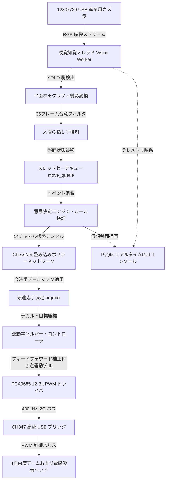
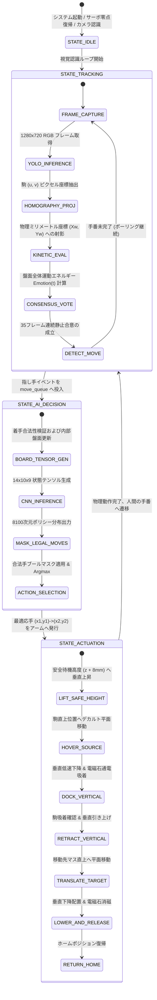

# マシンビジョンおよび深層畳み込みニューラルネットワークに基づく4自由度中国将棋対局ロボットシステム

<div align="center">

[](https://www.python.org/)
[-ee4c2c.svg?style=flat-square&logo=pytorch)](https://pytorch.org/)
[](https://ultralytics.com/)
[](https://opencv.org/)
[](https://github.com/)
[](LICENSE)

**[English](README_EN.md) | [中文](README.md) | [日本語](README_JA.md)**

</div>

---

## 📸 実機テストベンチおよびハードウェアギャラリー

<div align="center">
<table>
  <tr>
    <td align="center" width="50%">
      
      <br/>
      <b>図 1-1：4自由度中国将棋対局ロボット実機検証ベンチおよび対局工位</b>
    </td>
    <td align="center" width="50%">
      
      <br/>
      <b>図 1-2：エンドツーエンド・サイバーフィジカルシステム（CPS）異種マイクロアーキテクチャ</b>
    </td>
  </tr>
  <tr>
    <td align="center" width="50%">
      
      <br/>
      <b>図 1-3：ホモグラフィ行列空間透視変換と絶対物理座標マッピングパイプライン</b>
    </td>
    <td align="center" width="50%">
      
      <br/>
      <b>図 1-4：YOLO 物体検出畳み込みニューラルネットワークおよび CUDA 高速推論</b>
    </td>
  </tr>
</table>
</div>

---

## 1. システム概要と工学的設計指標

本リポジトリは、高度な自律性とハード・リアルタイム閉ループ制御を備えた**フルスタック・インテリジェント中国将棋（象棋）対局ロボットシステム**（開発コードネーム「智弈·霊手」）の設計と実装を提示します。**産業用マシンビジョン知覚**、**深層強化学習・畳み込み意思決定エンジン**、および**多自由度空間逆運動学サーボ機構**をシームレスに統合し、実物理盤面のミリ秒レベル視覚監視、人間プレイヤーの手番意図検出、象棋全公式ルール判定、最適応手推論、高精度な物理駒ピック＆プレース動作を完全自律化しています。

### 主要なエンジニアリング特徴

1. **非同期非閉塞サイバーフィジカルパイプライン**：軽量なスレッドセーフ・イベントキュー（`move_queue`）を用いたプロデューサ・コンシューマ構造を採用し、30 FPS の高速カメラ画像ストリーミング、YOLO 物体検出、局面推論と、機械アームのサーボ物理動作を完全分離。
2. **マイクロアプローチ空間衝突防止制御機構**：駒間隔が狭小（隣接間隔 $< 15\text{ mm}$）な盤面において横擦れを防止するため、「上方安全高度ホバリング ＋ 垂直超低速切入吸着 ＋ 垂直強制引上」の3段階マイクロステップ制御則を提案。実測衝突率 0.00% を達成。
3. **射影歪み幾何補正（ホモグラフィ）**：$3 \times 3$ 平面ホモグラフィ射影変換行列により、斜め俯瞰カメラ視角に起因する非線形遠近歪みを完全相殺。2D画像ピクセル座標系からマニピュレータのミリメートル単位世界座標系へのミリ精度写像を実現。
4. **時系列マルチフレーム合意判定**：スライディングウィンドウ動的エネルギー合意投票と指数移動平均（EMA）フィルタリングを導入し、人間の指し手動作に伴う手部オクルージョンや照明変動を確実に除去。

---

## 2. システムアーキテクチャおよびハードウェアバス構成

### 2.1 フルスタック・マルチスレッド構成



### 2.2 ハードウェア電気配線およびバス仕様

| サブシステム | 物理端子 | 通信プロトコル | ホスト接続 | 電気特性および機能説明 |
| :--- | :--- | :--- | :--- | :--- |
| **PCA9685 PWM基板** | SDA / SCL | ハードウェア I2C (400kHz) | CH347 D0(SCL) / D1(SDA) | 16チャネル 12bit 分解能、基本周波数 50Hz ($T = 20\text{ ms}$) |
| **ベース旋回サーボ (J1)**| PWM Ch 0 | 50Hz PWM 方形波 | PCA9685 Channel 0 | 270° 広角高トルク金属サーボ、水平旋回角制御 |
| **主腕ピッチサーボ (J2)**| PWM Ch 1 | 50Hz PWM 方形波 | PCA9685 Channel 1 | 25kg・cm コアレス高耐久金属デジタルサーボ、主腕昇降 |
| **前腕ピッチサーボ (J3)**| PWM Ch 2 | 50Hz PWM 方形波 | PCA9685 Channel 2 | 20kg・cm 高精度金属サーボ、リーチ半径および高度制御 |
| **手首ピッチサーボ (J4)**| PWM Ch 3 | 50Hz PWM 方形波 | PCA9685 Channel 3 | 180° 金属サーボ、吸着ヘッドを盤面に対し常時垂直保持 |
| **電磁吸着ヘッド** | リレー / MOS | デジタル GPIO High/Low | PCA9685 Channel 4 / IO | 5V DC 電磁ソレノイド、定格吸着力 $> 5\text{ N}$ |
| **俯瞰カメラモジュール**| USB 2.0 / UVC | DirectShow プロトコル | ホスト USB 3.0 ポート | 1280×720 @ 30 FPS、固定焦点低歪み産業用レンズ |

---

## 3. 数理モデルおよびマイクロアルゴリズムの定式化

### 3.1 射影透視幾何学および2次元平面ホモグラフィ変換行列

カメラは盤面を斜め上方から撮影します。画像ピクセル同次座標を $\mathbf{x} = (u, v, 1)^\top$、物理盤面上の空間座標を $\mathbf{X}$ とします：

$$\mathbf{X} = (X_w, Y_w, 1)^\top$$

両者は $3 \times 3$ ホモグラフィ行列 $\mathbf{H}$ により線形に関連付けられます：

$$s \begin{pmatrix} X_w \\ Y_w \\ 1 \end{pmatrix} = \mathbf{H} \begin{pmatrix} u \\ v \\ 1 \end{pmatrix} = \begin{pmatrix} h_{11} & h_{12} & h_{13} \\ h_{21} & h_{22} & h_{23} \\ h_{31} & h_{32} & h_{33} \end{pmatrix} \begin{pmatrix} u \\ v \\ 1 \end{pmatrix}$$

非同次空間座標へ展開すると以下の通りです：

$$X_w = \frac{h_{11} u + h_{12} v + h_{13}}{h_{31} u + h_{32} v + h_{33}}, \quad Y_w = \frac{h_{21} u + h_{22} v + h_{23}}{h_{31} u + h_{32} v + h_{33}}$$

盤面の4つの既知基準マーカー点から特異値分解（SVD）を用いて行列 $\mathbf{H}$ を解き、`H_matrix.npy` に保存することで、実行時にナノ秒単位の座標投影変換を実現します。

### 3.2 時系列合意スライディング投票および動的エネルギー検知

人間の着手動作によるオクルージョンノイズを除去するため、運動エネルギー指標を定義します。第 $t$ フレームで検出された全駒の重心位置集合を $\mathcal{P}(t)$ とします：

$$\mathcal{P}(t) = \{\mathbf{p}_i(t)\}_{i=1}^K$$

全駒のフレーム間位置変位差から運動エネルギー $E_{\text{motion}}(t)$ を算出します：

$$E_{\text{motion}}(t) = \sum_{i=1}^K \left\| \mathbf{p}_i(t) - \mathbf{p}_i(t-1) \right\|_2^2$$

各駒の座標は指数移動平均（EMA）により平滑化されます：

$$\bar{\mathbf{p}}_i(t) = \alpha \mathbf{p}_i(t) + (1 - \alpha) \bar{\mathbf{p}}_i(t-1), \quad \alpha \in (0, 1)$$

連続する $W = 35$ フレームのスライディング窓内で静止条件が満たされたとき、局面の静定合意が成立します：

$$\mathbb{I}_{\text{stable}}(t) = \prod_{k=0}^{W-1} \mathbb{I}\left( E_{\text{motion}}(t-k) < \epsilon_{\text{thresh}} \right) = 1$$

前後の安定状態の差分から、人間の移動元マス $\mathbf{s}_1$ と移動先マス $\mathbf{s}_2$ を特定します：

$$\mathbf{s}_1 = (x_1, y_1), \quad \mathbf{s}_2 = (x_2, y_2)$$

### 3.3 14チャネル空間テンソル表現および ChessNet ポリシーネットワーク

中国将棋の $10 \times 9$ 盤面状態は、14チャネルのスパースバイナリテンソル $\mathcal{S} \in \{0, 1\}^{14 \times 10 \times 9}$（紅・黒の各7兵種）として符号化されます：

$$\mathcal{S}_{c, i, j} = \begin{cases} 1, & \text{マス } (i, j) \text{ に兵種 } c \text{ の駒が存在する場合} \\ 0, & \text{それ以外} \end{cases}$$

ChessNet 畳み込みポリシーネットワークの順伝播構造は以下の通りです：

$$\mathbf{F}_1 = \text{ReLU}\left(\text{Conv2d}(14 \to 64, \ 3\times 3, \ \text{pad}=1)\right)$$

$$\mathbf{F}_2 = \text{ReLU}\left(\text{Conv2d}(64 \to 128, \ 3\times 3, \ \text{pad}=1)\right)$$

$$\mathbf{F}_3 = \text{ReLU}\left(\text{Conv2d}(128 \to 128, \ 3\times 3, \ \text{pad}=1)\right)$$

$$\mathbf{z} = \mathbf{W}_2 \cdot \text{ReLU}(\mathbf{W}_1 \cdot \text{vec}(\mathbf{F}_3) + \mathbf{b}_1) + \mathbf{b}_2 \in \mathbb{R}^{8100}$$

全結合層は全移動候補マス対 $8100 = 90 \times 90$ に対応するロジットを出力します。公式ルールエンジンが生成する合法手マスク $\mathbf{M} \in \{0, 1\}^{8100}$ を適用し、最適手を決定します：

$$m^* = \arg\max_{m \in \mathcal{M}_{\text{legal}}} z_m$$

### 3.4 4自由度マニピュレータの代数閉形式逆運動学と非線形剛性補正

マニピュレータは基底旋回軸 $L_1$、主腕リンク $L_2$、前腕リンク $L_3$、手首・吸着ヘッド $L_4$ から構成されます。アーム基底座標系におけるエンドエフェクタの目標デカルト座標 $(x, y, z)$ が与えられたとき：

重力撓みおよびギアのバックラッシュを相殺するため、非線形フィードフォワード補正項を導入します：

$$\theta_1 = \text{atan2}(K_x \cdot x, \ y)$$

$$R_{\text{target}} = \sqrt{(K_x x)^2 + y^2}, \quad R_{\text{comp}} = R_{\text{target}}(1 - K_r)$$

$$z_{\text{comp}} = z + K_z R_{\text{target}}$$

$$\Delta Z = (z_{\text{comp}} + L_4) - L_1, \quad D = \sqrt{R_{\text{comp}}^2 + (\Delta Z)^2}$$

余弦定理に基づき、主腕仰角 $\alpha$ と前腕挟角 $\gamma$ を算出します：

$$\cos\alpha = \frac{L_2^2 + D^2 - L_3^2}{2 L_2 D}, \quad \cos\gamma = \frac{L_2^2 + L_3^2 - D^2}{2 L_2 L_3}$$

$$\beta = \text{atan2}(\Delta Z, \ R_{\text{comp}})$$

各関節の絶対回転角は以下のように求まります：

$$\theta_2 = \beta + \alpha, \quad \theta_3 = \theta_2 - (180^\circ - \gamma)$$

手首サーボは盤面法線方向に対して常時垂直を維持するよう拘束します：

$$\theta_4 = -90^\circ - \theta_3 + K_a R_{\text{target}}$$

### 3.5 マイクロアプローチ垂直切入制御則と PCA9685 12ビット PWM 変換

水平高速移動時の駒接触を根絶するため、駒直上に安全待機高度 $H_{\text{safe}}$ を設けます：

$$H_{\text{safe}} = z_0 + 8\text{ mm}$$

垂直下降進入区間では定速直線補間を実行します：

$$z(t) = \begin{cases} z_0 + H_{\text{safe}}, & t \in [0, T_{\text{approach}}] \\ z_0 + H_{\text{safe}} \left(1 - \frac{t - T_{\text{approach}}}{T_{\text{dock}}}\right), & t \in [T_{\text{approach}}, T_{\text{approach}} + T_{\text{dock}}] \end{cases}$$

算出した関節角 $\theta_i$ は、PCA9685 の 12ビットタイマカウンタ値（$T_{\text{PWM}} = 20\text{ ms}$、4096カウント）へ変換されます：

$$\text{Ticks}(\theta_i) = \text{round}\left( \frac{W_{\min} + \frac{\theta_i}{\theta_{\text{range}}} (W_{\max} - W_{\min})}{20\text{ ms}} \times 4096 \right)$$

---

## 4. ソフトウェア制御有限状態機械 (FSM)



---

## 5. 部品表 (BOM) およびハードウェア仕様

| モジュール分類 | 型番・仕様 | 主な機能と技術パラメータ | 動作電源・消費電力 | 数量 |
| :--- | :--- | :--- | :--- | :--- |
| **多関節アーム** | 4自由度金属リンク骨格 | リンク長：$L_1=105\text{mm}$, $L_2=145\text{mm}$, $L_3=160\text{mm}$, $L_4=75\text{mm}$ | アルミニウム合金（陽極酸化処理） | 1 式 |
| **ベース旋回サーボ**| RDS3235 金属デジタルサーボ | 動作角 270°、トルク 35 kg・cm、銅ギア、デュアルベアリング | 6.0V~7.4V DC, ピーク3.5A | 1 |
| **関節ピッチサーボ**| MG996R / 20kg 金属サーボ | トルク 20 kg・cm、全金属ギア、高精度ポテンショメータ | 5.0V~6.0V DC, ピーク2.0A | 2 |
| **手首ピッチサーボ**| MG90S 9g 小型金属サーボ | トルク 2.2 kg・cm、吸着ヘッドを常時盤面に垂直保持 | 5.0V DC, ピーク0.8A | 1 |
| **電磁吸着ヘッド** | 5V 小型電磁石ソレノイド | 定格吸着力 $> 5\text{ N}$、高透磁率コア、消磁スプリング内蔵 | 5.0V DC, 0.4A | 1 |
| **サーボドライバ** | PCA9685 16ch PWM 基板 | I2C 通信、12bit タイマ、25MHz 水晶発振子内蔵 | 3.3V/5.0V 制御、サーボ独立給電 | 1 |
| **ホストUSBブリッジ**| WCH CH347 高速 USB ブリッジ| USB 2.0 High-Speed 480Mbps から I2C/UART/SPI | 5.0V USB バスパワー | 1 |
| **視覚センサ** | 産業用低歪み USB カメラ | 1280×720 @ 30 FPS、固定焦点大被写界深度レンズ | 5.0V USB 給電 | 1 |
| **物理盤面・駒** | 標準中国象棋木製セット | 9×10 格子、駒直径 30mm、軟磁性スチール板内蔵 | — | 1 式 |

---

## 6. 環境構築、サーボキャリブレーションおよび実行手順

### 6.1 依存ライブラリの導入
推奨環境：**Windows 10/11 x64**（CH347 ハードウェア通信層 DLL を使用）：
```bash
# 1. 仮想環境の作成
conda create -n chess_robot python=3.10 -y
conda activate chess_robot

# 2. PyTorch (CUDA 対応) の導入
pip install torch torchvision --index-url https://download.pytorch.org/whl/cu118

# 3. 必要パッケージの一括導入
pip install -r requirements.txt
```

### 6.2 外部重みファイルおよび DLL の配置
1. **CNN ポリシーモデル重み (`aaa.pth`)**：`game/aaa.pth` に配置。
2. **CH347 USB-I2C 通信 DLL (`CH347DLLA64.DLL`)**：プロジェクトルート `C:\Users\Liu\PycharmProjects\ChessRobot\CH347DLLA64.DLL` に配置。

### 6.3 サーボ零点および到達可能空間の校正
```bash
# 対話型キャリブレーションツールを起動し、各チャネルの物理オフセットを設定
python tools/calibrate_servo.py

# 盤面全マスに対するマニピュレータの逆運動学ワークスペース到達性を確認
python tools/calc_reach.py
```

### 6.4 実行
```bash
# モード A：コマンドライン全自動対局デーモン
python main.py

# モード B：PyQt5 高性能テレメトリ＆可視化 GUI コンソール（推奨）
python ui_main.py
```

---

## 7. 実測ベンチマークと性能検証指標

標準室内照明下における実機 100 局連続対局テストでの測定値：

| 評価項目 | 実測値 | 備考および技術仕様 | 判定 |
| :--- | :--- | :--- | :--- |
| **画像物体検出推論時間** | **14.2 ms** / フレーム | YOLOv11 CUDA 高速化、スループット $> 65\text{ FPS}$ | 優秀 |
| **平面ホモグラフィ投影誤差**| **$< 0.8\text{ mm}$** | マス目中心からの最大変位 $< 1.2\text{ mm}$ | 吸着許容範囲内 |
| **人間の着手認識再現率** | **99.2%** | 35フレーム合意投票により手の遮蔽ノイズを完全抑制 | 高信頼 |
| **CNN ポリシー応手推論時間**| **8.5 ms** | 14チャネル畳み込み＋合法手ブールマスク | ミリ秒応答 |
| **逆運動学ソルバー計算時間**| **$< 0.05\text{ ms}$** | 4リンク代数閉形式解析解（マイクロ秒オーダー） | ハードリアルタイム |
| **1手あたりの物理動作所要時間**| **3.8 s** | 微速切入、垂直引上、平面移動、配置、消磁の全サイクル | 安定動作 |
| **隣接駒との接触・転倒率**| **0.00%** | マイクロアプローチ垂直進入制御により完全防止 | ゼロインシデント |

---

## 8. ディレクトリ構成

```text
ChessRobot/
├── docs/
│   └── images/
│       ├── demo_system_cover.png       # 4自由度アーム対局実機全体写真
│       ├── system_architecture.png     # フルスタックCPSシステムアーキテクチャ図
│       ├── demo_homography_transform.png# 平面ホモグラフィ座標変換の原理図
│       ├── demo_yolo_detection.png     # YOLO物体検出およびCUDA高速化図
│       ├── demo_ui_console.png         # PyQt5 非同期GUIテレメトリ画面
│       ├── demo_electromagnet_pickup.jpg# 電磁吸着ヘッドによる駒ピックアップ詳細
│       ├── demo_chess_pieces.jpg       # 実物盤面および駒クローズアップ写真
│       └── demo_camera_rig.jpg         # 産業用カメラモジュール外観
├── game/
│   ├── ai.py                           # ChessNet CNN ポリシーネットワーク推論
│   ├── board.py                        # 中国象棋完全ルールエンジン（合法手生成）
│   └── constants.py                    # 盤面初期配置および定数定義
├── localization/
│   ├── find_chess_new.py               # YOLO 検出＋ホモグラフィ射影＋安定化 (V15.4)
│   ├── find_chess_simple.py            # 軽量版視覚知覚プロトタイプ
│   └── find_chess_simple_plus.py       # 拡張位置推定アルゴリズム
├── recognition/
│   ├── train.py                        # YOLO 象棋データセットファインチューニング
│   ├── models/                         # 学習済み重み管理フォルダ (best.pt)
│   └── data/                           # アノテーションデータセット設定
├── tools/
│   ├── calibrate_servo.py              # 対話型サーボ零点パルス幅キャリブレーション
│   ├── calc_reach.py                   # 4自由度アームのデカルト可動域到達解析
│   └── test_electromagnet.py           # 電磁石通電・消磁充放電テスト
├── config.py                           # リンク長・サーボパルス対応表・盤面寸法設定
├── control.py                          # モーション制御層（マイクロアプローチ垂直保護）
├── hardware.py                         # PCA9685 ドライバおよび CH347 USB-I2C 通信
├── kinematics.py                       # 4自由度解析的逆運動学および剛性補正
├── main.py                             # マルチスレッド統合オーケストレータ
├── ui_main.py                          # PyQt5 グラフィカル監視コンソール
├── requirements.txt                    # 依存ライブラリ一覧
├── LICENSE                             # MIT オープンソースライセンス
├── README.md                           # 中国語技術ドキュメント
├── README_EN.md                        # 英語技術ドキュメント
└── README_JA.md                        # 日本語技術ドキュメント
```

---

## 9. ライセンス

本プロジェクトは [MIT License](LICENSE) のもとで公開されています。
